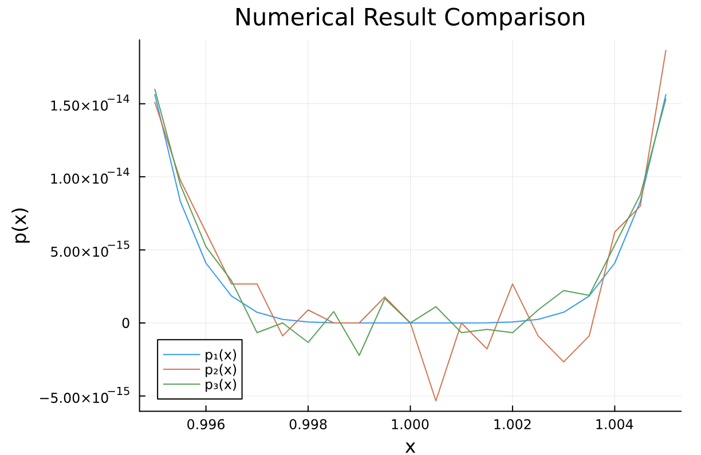

# Summary for 204381: Chapter 1

<aside>
📚 **Organized by**
Saksinkarn Petchkuljinda
630510600

</aside>

<aside>
📄 **********************************Basic Information**********************************
Date: 27 August 2023
Time: 3:30 PM — 6.30 PM
Venue: TBA
**★ Calculator 🧮    ☆ Open Book 🙌🏼**

</aside>

# Table of Contents

---

# IEEE-754: Floating-point Representation

## Definition

For 32-bit (**single** precision):

$$

\underbrace{0}_\text{sign}
\overbrace{00000000}^\text{8-bit exponent}
\underbrace{00000000000000000000000}_\text{23-bit mantissa}

$$

For 64-bit (**double** precision):

$$

\underbrace{0}_\text{sign}
\overbrace{00000000000}^\text{11-bit exponent}
\underbrace{0000000000000000000000000000000000000000000000000000}_\text{52-bit mantissa}

$$

For 16-bit (********half******** precision; added in 2008):

$$

\underbrace{0}_\text{sign}
\overbrace{00000}^\text{5-bit exponent}
\underbrace{0000000000}_\text{10-bit mantissa}

$$

For any real $x$, it can be represented as:

$$

x = (-1)^s \cdot (1 + m) \cdot 2^{e}

$$

where $s$ be a sign bit, $m = \sum^{52}_{i=1} m_i 2^{-i}$*, and* $e = \sum^{10}_{i = 0} c_i 2^i - \overline{c}$ which $\overline{c} = 1023$ in double precision,  $\overline{c} = 127$ in single precision, and $\overline{c} = 15$ in half precision.

## Special Cases for IEEE 754 Representation

### Zero

It is nearly impossible to represent $0$ with IEEE 754. Let's say $s = m = e = 0$, if substituted, then we get:

$$

\underbrace{0}_\text{sign}
\overbrace{00000000}^\text{8-bit exponent}
\underbrace{00000000000000000000000}_\text{23-bit mantissa}

$$

This is called **positive zero (written as** $+0$**)**.

Meanwhile,

$$

\underbrace{1}_\text{sign}
\overbrace{00000000}^\text{8-bit exponent}
\underbrace{00000000000000000000000}_\text{23-bit mantissa}

$$

is called **negative zero (written as** $-0$**)**.

**Therefore, regardless of the sign bit, if both** $m = 0$ **and** $e = 0$**, then the value is** $0$**.**

### Denormalized Numbers

If $e = 0$ and $m \neq 0$, the number will be considered **denormalized**.

In normalized number, we specify $m$ with an assumption that the value can be represented as:

$$

x = (-1)^s \times 1.m \times 2^e = (-1)^s \times 1.d_0d_1d_2... \times 2^e

$$

Where $d_0, d_1, d_2, ...$ are the decimal-point binary digits of $m$. We assume that the mantissa is in the range $[1, 2)$

However, if $e = 0$, we assume that the mantissa is in the range $[0, 1)$ instead, or:

$$

x = (-1)^s \times 0.m \times 2^{1-\overline{c}} = (-1)^s \times 0.d_0d_1d_2... \times 2^{1-\overline{c}}

$$

For example, this 32-bit number is denormalized

$$

\underbrace{0}_\text{sign}
\overbrace{00000000}^\text{8-bit exponent}
\underbrace{10001111100110111100010}_\text{23-bit mantissa}

$$

So its values is

$$

x = (-1)^0 \times (0 + 2^{-23} + 2^{-19} + 2^{-18} +...) \times 2^{-126}

$$

According to this rule, **the minimum non-zero positive value of 32-bit float numbers is**

$$

\begin{align*}
&\underbrace{0}_\text{sign}
\overbrace{00000000}^\text{8-bit exponent}
\underbrace{00000000000000000000001}_\text{23-bit mantissa}\\
&= (-1)^0 + \times (0 + 2^{-23}) \times 2^{-126}\\
&= 2^{-149}
\end{align*}

$$

For **64-bit float number is**

$$

\begin{align*}
&\underbrace{0}_\text{sign}
\overbrace{00000000000}^\text{11-bit exponent}
\underbrace{0000000000000000000000000000000000000000000000000001}_\text{52-bit mantissa}\\
&= (-1)^0 + \times (0 + 2^{-52}) \times 2^{-1022}\\
&= 2^{-1074}
\end{align*}

$$

For 16**-bit float number is**

$$

\begin{align*}
&\underbrace{0}_\text{sign}
\overbrace{00000}^\text{5-bit exponent}
\underbrace{0000000001}_\text{10-bit mantissa}\\
&= (-1)^0 + \times (0 + 2^{-10}) \times 2^{-14}\\
&= 2^{-24}
\end{align*}

$$

### Infinity

If $e$ is all $1's$ (i.e., or 1024 for double precision) and $m = 0$, then the value is either $+\infty$ or $-\infty$ (positive or negative infinity).

Therefore, the maximum possible exponent is only $11111111110_2 = 1023$.

If the value with a sign number of $0$ is

$$

\underbrace{0}_\text{sign}
\overbrace{11111111111}^\text{8-bit exponent}
\underbrace{00000000000000000000000}_\text{23-bit mantissa}

$$

it is the **positive infinity**, written as $+\infty$.

And if the value with a sign number of $1$ is

$$

\underbrace{1}_\text{sign}
\overbrace{11111111111}^\text{8-bit exponent}
\underbrace{00000000000000000000000}_\text{23-bit mantissa}

$$

it is the **negative infinity**, written as $-\infty$.

### NaN (Not a Number)

It is impossible to represent a mantissa of *infinity*. That is, if $e$ is **max** and $m$ is **non-zero**, then the value is $\text{NaN}$.

For example,

$$

\underbrace{0}_\text{sign}
\overbrace{11111111111}^\text{8-bit exponent}
\underbrace{10101010101010101010101}_\text{23-bit mantissa}

$$

is $\text{NaN}$.

## Case study: The largest possible number in 64-bit IEEE

The largest possible number is denoted in 64-digit binary number as:

$$

\underbrace{0}_\text{sign}
\overbrace{11111111110}^\text{11-bit exponent}
\underbrace{1111111111111111111111111111111111111111111111111111}_\text{52-bit mantissa}

$$

The first digit is the signed bit for the whole number, which is zero to indicate that the number is positive.

The next 11 digits are the exponent ($11111111110_2 = 1023$; ten digits of ones, then zero) Notice that the 12th digit (the rightmost digit of the exponent) is zero because that is the maximum exponent possible.

*Note:* $e$ *with all 1's is reserved for infinity value only, and infinity is not considered a real number according to mathematicians*.

Let's consider the mantissa and the exponent's values.

Consider

$$
\begin{align*}
e &= 0 \cdot 2^0 + 1 \cdot 2^1 + 1 \cdot 2^2 + ... +  1 \cdot 2^{10} - 1023 \\
&= 1023
\end{align*}

$$

Consider

$$
\begin{align*}
m &= 2^{-52} + \cancel{2^{-51} + ... + 2^{-1}} &\_\_\_(1)\\
2m &= \cancel{2^{-51} + ...  + 2^{-1}} + 2^{0} & \_\_\_ (2)\\
(2)-(1);\ \ \ \ \ 2m - m &= 2^{0} - 2^{-52}\\
m &= 1 - 2^{-52}
\end{align*}
$$

Consider the IEEE form of floating-point representation

$$
\begin{align*}
(-1)^s \cdot (1 + m) \cdot 2^{e}
&= \cancel{(-1)^0} \cdot (1 + 1 - 2^{-52}) \cdot 2^{1023} \\
&= 2^{1023} \cdot (2 - 2^{-52})
\end{align*}
$$

$$

\therefore \text{The maximum value of 64-bit IEEE float is } 2^{1023}(2 - 2^{-52})

$$

# Numerical Instability

There are 3 major problems regarding numerical errors.

## Round-off Error or Rounding Error

Rounding error usually occurs when calculating **floating-point numbers**. According to IEEE-754, a number of bits in ********mantissa******** determines the maximum possible precisions. Most of the time, floating-point numbers just cannot be represented as a sum of the negative power of 2.

For example, $0.1$ is simply $10^{-1}$ in decimal representation, but in the binary representation, it is $0.100110011001100110011001..._2$ (the repeating sequence of $1001$ after the binary point).

In 32-bit precision, the actual stored decimal value of $0.1$ is $0.100000001490116119384765625$, which is somewhat imprecise for detailed calculations.

To let you see a better picture, we will compare the value of $1.1$ and $1.1^6$ in both aspects of decimal and binary.

For decimal, let’s calculate by hand:

$$

\begin{align*}
1.1^6 &= (10^0 + 10^{-1})^6 \\
&= (1 + 10^{-1})^6 \\
&= (10^{-1})^6 + 6(10^{-1})^5 + 15(10^{-1})^4 + 20(10^{-1})^3 \\
&\ \ \ \ + 15(10^{-1})^2 + 6(10^{-1}) + (10^{-1})^0 \\
&= 0.000001 + 0.00006 + 0.0015 + 0.020 + 0.15 + 0.6 + 1 \\
&= 1.771561
\end{align*}

$$

Code:

```julia
x::Float32 = 1.1
y::Float32 = 1.771561
@printf("x   = %.23f\n", x)
@printf("x^6 = %.23f\n", x^6)
@printf("y   = %.23f\n", y)
```

Output:

```
x   = 1.10000002384185791015625
x^6 = 1.77156126499176025390625
y   = 1.77156102657318115234375
```

From the output, $x^6$ is supposed to equal $y$, but it’s not. The reason behind this error is because of these error digits `2384185791015625` that got multiplied 6 times, leading to even worse error.

********Therefore, arithmetic operations over floating-point numbers always lead to ***************rounding errors.*****************

To reduce the problem,

- Use **as less operations as possible**
- Compare with minimum absolute tolerance $\delta$ (usually $\delta=10^{-9}$)
    - ❌ `x == y`
    - ✅ `x - y < 1e-9`
    - In Julia, use `iszero(x - y)` is also possible and better.

## Overflow and Underflow

Overflow and Underflow happens when a number exceeds the capacity of numerical representations. It can occur in both **integers** and ********************floating-point numbers********************.

- ******************Integer:****************** This one is quite straightforward. If the number is too big, it causes overflow. Meanwhile, if it is too small, it causes underflow.
    
    
    | Code in C++ | Actual Value | Description |
    | --- | --- | --- |
    | int x = (1 << 30) + 555; | x = 1073742379 | Normal; it reaches neither the maximum nor minimum possible values of int |
    | int x = (1 << 31) + 12345; | x = -2147471303 | Over-flown; it exceeds the maximum possible value of int |
    | int x = -1; | x = -1 | Normal; it reaches neither the maximum nor minimum possible values of int |
    | int x = -2555555555; | x = 1739411741 | Under-flown; it exceeds the minimum possible value of int |
- ******************Floating-point:****************** If the number exceeds the smallest possible magnitude, the value becomes $0$, and if the number exceeds the largest possible magnitude, the value becomes $\infty$.
    
    
    | Code in Julia | Actual Stored Value | Description |
    | --- | --- | --- |
    | x::Float32 = 3.14159 | x = 3.141590118408203125 | Normal; it gets rounding error, but not overflown or under-flown. |
    | x::Float32 = 2^-16 | x = 0.0000152587890625 | Normal; it is not rounding error, and also not over-flown or under-flown. |
    | x::Float32 = 1e40 | x = Inf | Over-flown; it exceeds the maximum possible magnitude of Float32 on the positive side. |
    | x::Float32 = 1e-50 | x = 0.0 | Under-flown;  it exceeds the minimum possible magnitude of Float32on the positive side. |
    | x::Float32 = -1e-50 | x = -0.0 | Under-flown;  it exceeds the minimum possible magnitude of Float32 on the negative side. |
    | x::Float32 = -1e40 | x = -Inf | Over-flown; it exceeds the maximum possible magnitude of Float32on the negative side. |

To avoid overflow/underflow:

- Use some technique to store numbers indirectly, so that their magnitude would not exceed the minimum or maximum possible magnitude of specified types.
    - Avoid using powers, such as $r = \sqrt{x^2 + y^2}$ to calculate the radius of a circle because it increases the value significantly. Even though we put the square root to shrink the value, the term $x^2$ and $y^2$ can still only increases up to their maximum possible of the type (like the max. of `Float64`). Instead, use
        
        $$
        r = \begin{cases}
        |x|\sqrt{1-(y/x)^2} & \text{if }x\geq y, \\
        |y|\sqrt{1-(x/y)^2} & \text{if }y > x
        \end{cases}
        $$
        
        Here’s $y/x$ and $x/y$ got decreased before raised to the 2nd power, making it less prone to overflow.
        
    - Avoid using factorials, such as calculating the permutation $^nP_r$, which is
        
        $$
        ^nP_r= {n \choose r} = \frac{n!}{r!(n-r)!}
        $$
        
        Do not calculate $n!$, $r!$ and $(n-r)!$ one by one. Instead, calculate each fraction then multiply them together, like:
        
        $$
        \begin{align*}
        \frac{n!}{r!(n-r)!} &= \frac{n(n-1)...(n-r+1)\cancel{(n-r)!}}{r(r-1)...\cdot2\cdot1\cdot\cancel{(n-r)!}} \\
        &= \frac{n}{r}\cdot\frac{n-1}{r-1}\cdot\frac{n-2}{r-2}\cdot...\frac{n-r+1}{1}\\
        &= \prod^r_{i=1} \frac{n-r+i}{i}
        \end{align*}
        $$
        
    - Avoid dealing with considerably small or big numbers directly. For instance, a dataset containing probabilities of billions of words, like $0.00000000000000753 = 7.53\times10^{-15}$. This could cause underflow. Instead, use $\log(x)$:
        
        $$
        \log(7.53 \times 10^{-15}) = 14.1232050238
        $$
        
        This is even useful to calculate the product of probabilities. Normally, you may do $p_1\cdot p_2 \cdot p_3 \cdot ...$, but the value dramatically decreases then easily underflows. Instead, using log-scale 
        
        $$
        \log(p_1\cdot p_2 \cdot p_3 \cdot ...)=\log(p_1) + \log(p_2) + \log(p_3) + ...
        $$
        
        can easily avoid overflow due to the multiplication of probabilities.
        
- Use bigger types: In Julia, we can also use `BigInt` and `BigFloat` that can increase their size to support our huge needs.

The following table shows the sizes and possible values for integers in Julia (which are also most likely applicable to other programming languages as well)

| Type | Signed? | # of bits | Smallest | Largest |
| --- | --- | --- | --- | --- |
| https://docs.julialang.org/en/v1/base/numbers/#Core.Int8 | ✓ | 8 | $-2^7$ | $2^7 - 1$ |
| https://docs.julialang.org/en/v1/base/numbers/#Core.UInt8 |  | 8 | $0$ | $2^8 - 1$ |
| https://docs.julialang.org/en/v1/base/numbers/#Core.Int16 | ✓ | 16 | $-2^{15}$ | $2^{15} - 1$ |
| https://docs.julialang.org/en/v1/base/numbers/#Core.UInt16 |  | 16 | $0$ | $2^{16} - 1$ |
| https://docs.julialang.org/en/v1/base/numbers/#Core.Int32 | ✓ | 32 | $-2^{31}$ | $2^{31} - 1$ |
| https://docs.julialang.org/en/v1/base/numbers/#Core.UInt32 |  | 32 | $0$ | $2^{32} - 1$ |
| https://docs.julialang.org/en/v1/base/numbers/#Core.Int64 | ✓ | 64 | $-2^{63}$ | $2^{63} - 1$ |
| https://docs.julialang.org/en/v1/base/numbers/#Core.UInt64 |  | 64 | $0$ | $2^{64} - 1$ |
| https://docs.julialang.org/en/v1/base/numbers/#Core.Int128 | ✓ | 128 | $-2^{127}$ | $2^{127} - 1$ |
| https://docs.julialang.org/en/v1/base/numbers/#Core.UInt128 |  | 128 | $0$ | $2^{128} - 1$ |
| https://docs.julialang.org/en/v1/base/numbers/#Core.Bool | N/A | 8 | false (0) | true (1) |

And for floating-point numbers.

| Type | Precision | # of bits | Absolute Smallest | Absolute Largest |
| --- | --- | --- | --- | --- |
| https://docs.julialang.org/en/v1/base/numbers/#Core.Float16 | https://en.wikipedia.org/wiki/Half-precision_floating-point_format | 16 | $2^{-24} \approx 5.96\times10^{-8}$ | $2^{15}\cdot(2-2^{-10}) = 65,504$ |
| https://docs.julialang.org/en/v1/base/numbers/#Core.Float32 | https://en.wikipedia.org/wiki/Single_precision_floating-point_format | 32 | $2^{-149} \approx 1.40\times10^{-45}$ | $2^{127}\cdot(2-2^{-23})=3.40 \times 10^{38}$ |
| https://docs.julialang.org/en/v1/base/numbers/#Core.Float64 | https://en.wikipedia.org/wiki/Double_precision_floating-point_format | 64 | $2^{-1074} \approx 5 \times 10^{-324}$ | $2^{1023}\cdot(2-2^{-52}) = 1.8 \times 10^{308}$ |

## Cancellation Errors

Cancellation Errors happen due to the mitigation of significant digits (from minus operation) between 2 close floating-point numbers.

Suppose we have `x1::Float32 = 12.4` and `x2::Float32 = 12.1`, and we want to calculate `x1 - x2`, as follows:

$$
\begin{align*}
&x_1 = & \cancel{\textcolor{grey}{1.}1000}1100110011001100110_2 \times 10_2^{10000010} \\
-&x_2 =- & \cancel{\textcolor{grey}{1.}1000}0011001100110011010_2 \times 10_2^{10000010} \\
&&\_\_\_\_\_\_\_\_\_\_\_\_\_\_\_\_\_\_\_\_\_\_\_\_\_\_\_\_\_\_\_\_\_\_\_\_ \\
&& \cancel{\textcolor{grey}{0.0000}}1001100110011001100_2 \times 10_2^{10000010} \\
&& \text{========================}
\end{align*}
$$

As you can see, the result starts with `0.`, not `1.`, which violates the IEEE-754 standard (unless the number is significantly small enough to become denormalized).

To comply with IEEE-754 once again, the decimal point must be shifted 5 places to the right, like so:

$$
\begin{align*}
&\cancel{\textcolor{grey}{0.0000}}1100110011001100110_2 &\times 10_2^{10000010} \\
=\  &1.001100110011001100_2\textcolor{red}{\leftarrow} &\times 10_2^{\textcolor{green}{01111101}} \\
=\ & 1.001100110011001100\textcolor{red}{00000}_2 &\times 10_2^{\textcolor{green}{01111101}}
\end{align*}
$$

This means:

- We lost 5 valuable digits—or we lost numerical precision—more errors were added.
- There are 5 more rooms for more error bits in the future.

To avoid this problem, just use **as less minus operators as possible.**

### Case study: Polynomial Expressions

Suppose we have the following different forms of polynomials:

$$

\begin{align*}
\mathrm{p}(x) &= (x - 1)^6 & := \mathrm{p}_1(x) \ \ \_\text{(1)} \\
&= x^6 - 6x^5 + 15x^4 - 20x^3 +15x^2 - 6x + 1 & := \mathrm{p}_2(x) \ \ \_\text{(2)} \\
&= 1 + x(-6 + x(15 + x(-20 + x(15 + x(-6 + x))))) & := \mathrm{p}_3(x) \ \ \_\mathrm{(3)}
\end{align*}

$$

where:

- $\text{p}_1(x)$ is written as a power of binomial.
- $\text{p}_2(x)$ is the expanded form of $\text{p}_2(x)$.
- $\text{p}_3(x)$ is the [Horner's form](https://en.wikipedia.org/wiki/Horner%27s_method) of $\text{p}_1(x)$, which is computationally efficient as it reduces the amount of multiplications (the powered terms like $x^n$)

Plot the graph of each polynomial in Julia, we get:



Here we can see that $\text{p}_1(x)$ is the most stable because it got subtracted only once in $x-1$, then the stored value will get raised to the 6th power; $x-1$ was not calculated repeatedly for 6 times.

$\text{p}_2(x)$ performs the worst here because of both overflow (from powers), cancellation errors (substraction), and rounding errors (20 multiplying operations; too much).

$\text{p}_3(x)$ is in the middle since it’s not prone to overflow/underflow, but it still faces less severe rounding errors (because there are only 5 multiplying operations) and cancellation errors.

### Case study: Statistical Variance Formulas

There are two standard formulas given in textbooks to compute the sample variance $s^2$ of the number $x_1, x_2, ..., x_n$:

$$

\begin{align*}
s^2 &= \frac{1}{n-1} \Big[\sum^n_{i=1} x_i^2 - \frac{1}{n} \Big(\sum^n_{i=1} x_i\Big)^2\Big]
&\ \ \_\text{(1)}\\
\text{First\ compute\ }\bar{x} = \frac{1}{n} \sum^n_{i=1} x_i,
\text{\ and\ then\ }s^2 &= \frac{1}{n-1} \sum^n_{i=1} \big(x_i-\bar{x}\big)^2
&\ \ \ \text{(2)}
\end{align*}

$$

Let’s discuss in all 3 aspects of numerical  instability:

- ******************************Round-off error******************************
    
    In this case, **formula (1) is prone to [round-off](https://en.wikipedia.org/wiki/Round-off_error) error.** The squared terms $x_i^2$ and $(\sum_{i=1}^nx_i)^2$ cause round-off errors due to the limitation of floating-point number representation, like the mantissa of [IEEE 754's double precision](https://en.wikipedia.org/wiki/Double-precision_floating-point_format). Such the product reduces the accuracy of the number *(by increasing the difference between the exact arithmetic and computed value)*
    
    Meanwhile, **formula (2)** is also, but less, prone to round-off error because the squaring only happens once from $(x_i - \overline{x})^2$.
    
- ************************************Overflow/Underflow************************************
    
    In this case, **formula (1) is more prone to overflow or underflow**, particularly the terms $x_i^2$ and especially $(\sum^n_{i=1} x_i)^2$, which may be considerably large, where the value got squared. So it is possible that the squared product might exceed the capacity of, let's say, the *[IEEE 754's double precision](https://en.wikipedia.org/wiki/Double-precision_floating-point_format)*
    
    Meanwhile, **formula (2)** deducts each value of $x_i$ with $\overline{x}$ that significantly reduces the magnitude (size of values, or absolute) of the data closer to zero before getting squared, so less likely to overflow/underflow.
    
    *Note: underflow can happen when a (big) negative number is presented in the sequence.*
    
- ************************************Cancellation Error************************************
    
    **BOTH** **formula (1)** and **formula (2)** are prone to *cancellation error* because:
    
    - In **formula (1)**, $\sum^n_{i=1} x_i^2 - \frac{1}{n} (\sum^n_{i=1} x_i)^2$ is the subtraction of floating-point numbers.
    - In **formula (2)**, $x_i-\bar{x}$ is the subtraction of floating-point numbers.
    
    But **formula (1)** is worse because the subtraction may increase the error derived from both squared terms $x_i^2 - (\sum_{i=1}^nx_i)^2$, which is the round-off error we mentioned earlier.
    
    $n-1$ doesn't count here because $n$ is an integer.
    

# Condition Numbers

Suppose we have a function $f: X \rightarrow Y$. $f$ is consider a *well-conditioned function* if changes in $X$ do not significantly affect $Y$. And *ill-conditioned function* otherwise.

## Definition

An **absolute condition number** is denoted as $c$, such that:

$$
\begin{align*}
c &= \lim_{\Delta x \to 0} \frac{|f(x+\Delta x) - f(x)|}{|\Delta x|}\\ &= |f\prime(x)|
\end{align*}
$$

A **relative condition number** is denoted as $\kappa$, such that:

$$
\begin{align*}
\kappa &= \lim_{\Delta x \to 0} \frac{|f(x + \Delta x) - f(x)|/|f(x)|}{|\Delta x|/|x|} \\
&= \frac{|x|\times|f\prime(x)|}{f(x)}
\end{align*}
$$

The exact size of condition numbers do not generally determine whether a function is ill- or well-conditioned. However, if both types of condition numbers go beyond $1$, the function is probably ill-conditioned.

If we consider a multivariate function, the definition is a little different. We will first normalize each matrix/vector before implementing to $c$ and $\kappa$.

For a differentiable function to the second order $f: \mathbb{R}^n \rightarrow \mathbb{R}^m$ that,

$$
f([x_1, x_2, ..., x_n]) =
\begin{bmatrix}
f_1([x_1, x_2, ..., x_n]) \\
f_2([x_1, x_2, ..., x_n]) \\
... \\
f_m([x_1, x_2, ..., x_n])
\end{bmatrix}
$$

we define a **Jacobian matrix** as a matrix of partial derivatives such that:

$$
J_f (x_1, x_2, ..., x_n) =
\begin{bmatrix}
\frac{\partial f_1}{\partial x_1} & \frac{\partial f_1}{\partial x_2} & ... & \frac{\partial f_1}{\partial x_n} \\
\frac{\partial f_2}{\partial x_1} & \frac{\partial f_2}{\partial x_2} & ... & \frac{\partial f_2}{\partial x_n} \\
... & ... & ... & ... \\
\frac{\partial f_m}{\partial x_1} & \frac{\partial f_m}{\partial x_2} & ... & \frac{\partial f_m}{\partial x_n}
\end{bmatrix}
$$

We define a **norm** of a **vector** (or ***[p*-norm at p=∞](https://en.wikipedia.org/wiki/Norm_(mathematics)#p-norm)**, to be precise) as

$$
||\vec{x}||_\infty = \max_{1\leq i \leq n} |x_i|
$$

We define a **norm** of a **matrix** (or ***[p*-norm induced matrix at p=∞](https://en.wikipedia.org/wiki/Matrix_norm#Matrix_norms_induced_by_vector_p-norms)** to be precise) as

$$
||M||_\infty = \max_{1\leq i \leq m} \sum^n_{j=1} |x_{ij}|
$$

An **absolute condition number** for a multivariate function $f$ is

$$
c = ||J||_\infty
$$

A **relative condition number** for a multivariate function $f$ is

$$
\begin{align*}
\kappa &= \lim_{\Delta x \to 0} \frac{||f(x + \Delta x) - f(x)||_\infty / ||f(x)||_\infty}{||\Delta x||_\infty/||x||_\infty} \\
&= \frac{||J||_\infty}{||f(\vec{x})||_\infty/||\vec{x}||_\infty}
\end{align*}
$$

if $||J||_\infty ≫ 1$ , it is considered *ill-conditioned*.

## Example

**Consider if $f(x) = x^2$ is a well-conditioned function?**

Consider

$$
\begin{align*}
f\prime(x) &= \frac{d}{dx} (x^2) \\
&= 2x
\end{align*}

$$

Consider the absolute and the relative condition number

$$

\begin{align*}
c_f &= |f\prime(x)| \\
&= |2x|
\end{align*}

$$

and

$$

\begin{align*}
\kappa_f &= \frac{|x|\times|f\prime(x)|}{f(x)} \\
&= \frac{\cancel{|x|} \times |2\cancel{x}|}{\cancel{|x^2|}} \\
&= 2
\end{align*}

$$

Though the absolute condition number $c_f$ is relatively large when $x$ is large, the relative condition $\kappa_f$ number indicates that $f$ is acceptably *well-conditioned* (though I mentioned that condition numbers greater than 1 is probably ill-condition, it is that not always)

**Consider if $f(x) = \mathrm{sin}(10^8 x)$ is a well-conditioned function?**

Consider

$$

\begin{align*}
f\prime(x) &= \frac{d}{dx} \mathrm{sin}(10^8 x) \\
&= 10^8 \mathrm{cos}(10^8 x)
\end{align*}

$$

Consider the absolut

e and the relative condition number

$$

\begin{align*}
c_f &= |f\prime(x)| \\
&= |10^8 \mathrm{cos}(10^8 x)|
\end{align*}

$$

and

$$

\begin{align*}
\kappa_f &= \frac{|x|\times|f\prime(x)|}{f(x)} \\
&= \frac{|x| \times |10^8 \mathrm{cos}(10^8 x)|}{\mathrm{sin}(10^8 x)} \\
&= 10^8 |x\cdot\mathrm{cot}(10^8 x)|
\end{align*}

$$

Both condition numbers obviously indicate that the function is definitely *ill-conditioned* even a trivial change of $x$.

**Consider if $f(\vec{x}) = x_1 - x_2$ a well-conditioned function?**

To be precise, $f(\vec{x})$ is a function defined on $\mathbb{R}^2 \rightarrow \mathbb{R}$ that

$$

f([x_1, x_2]) = \begin{bmatrix} x_1 - x_2 \end{bmatrix}_{1\times 1}

$$

Consider

$$

\begin{align*}
J_f &=
\begin{bmatrix}
\frac{\partial f}{\partial x_1} & \frac{\partial f}{\partial x_2}
\end{bmatrix} \\
&=
\begin{bmatrix}
1 & -1
\end{bmatrix}
\end{align*}

$$

Then $||J_f||_\infty = \max\{|1|, |-1|\} = 1 := c_f$ is the **absolute** condition number of $f$.

Consider the **relative** condition number

$$

\kappa_f = \frac{||J_f||_\infty}{||f(\vec{x})||_\infty/||\vec{x}||_\infty}

$$

Consider $||f(\vec{x})||_\infty$,

$$

\begin{align*}
||f(\vec{x})||_\infty &= \max_{1\leq j \leq 1} \sum^1_{i=1} |x_{ij}|; x_{ij} \in f(\vec{x}) \\
&= |x_1 - x_2|
\end{align*}

$$

Consider $||\vec{x}||_\infty$

$$

\begin{align*}
||\vec{x}||_\infty &= \max_{1\leq i \leq 2} |x_i|; x_i \in \vec{x} \\
&= \max\{|x_1|, |x_2|\}
\end{align*}

$$

Then

$$

\begin{align*}
\kappa_f &= \frac{1}{||x_1 - x_2||_\infty/\max\{|x_1|, |x_2|\}} \\
&= \frac{\max\{|x_1|, |x_2|\}}{|x_1 - x_2|}
\end{align*}

$$

According to $\kappa_f$, the relative condition number would be fine in most cases, but if $x_1 \approx x_2$ or $|x_1 - x_2| \approx 0$, it can be considerably high. So this function is *ill-conditioned* overall. This case corresponds to the **cancellation errors**.