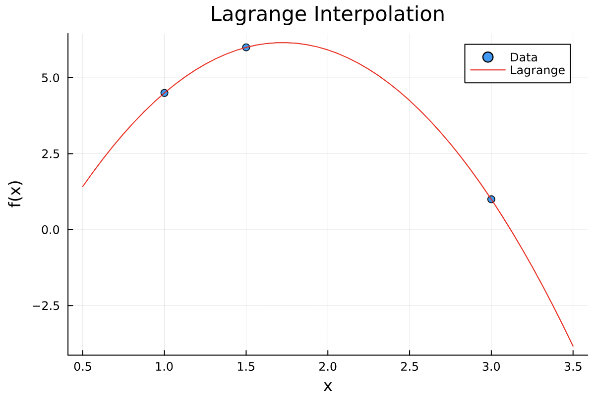
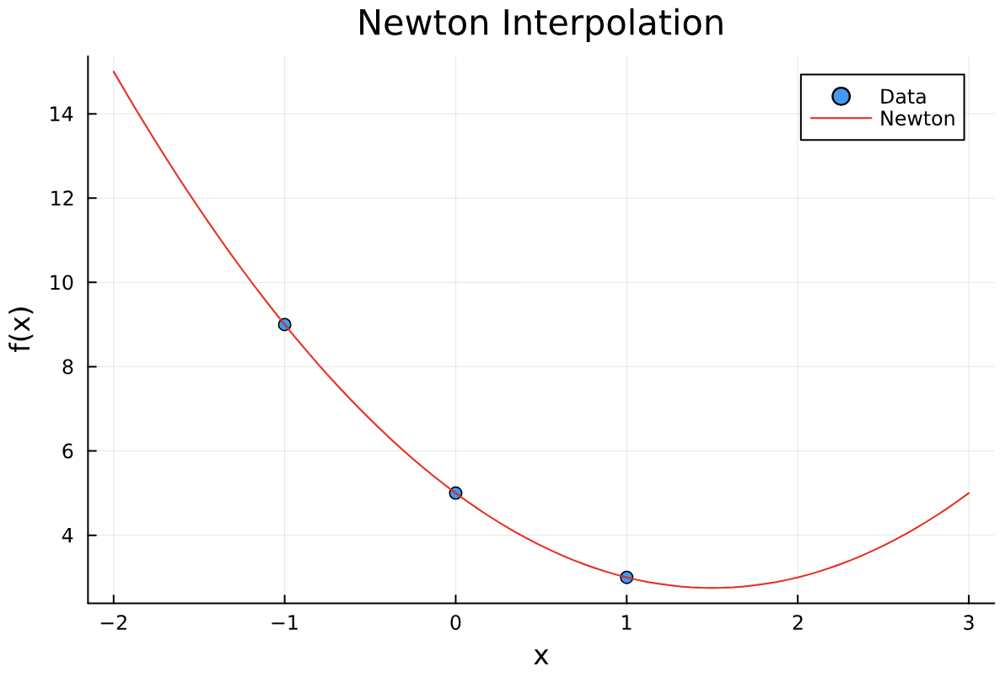
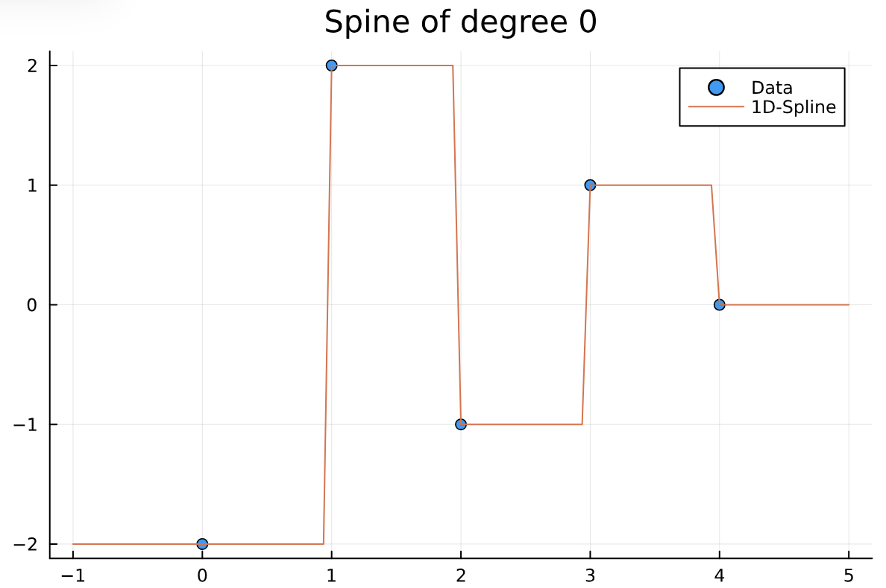
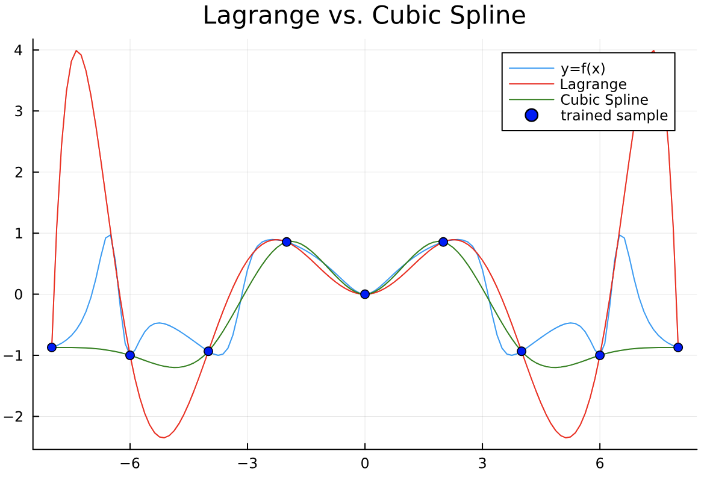
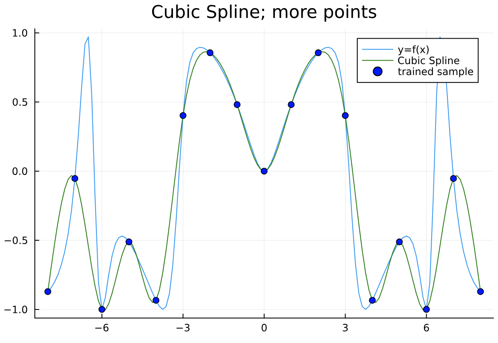

# Summary for 204381: Chapter 2

<aside>
📚 **Organized by**
Saksinkarn Petchkuljinda
630510600

</aside>

<aside>
📄 **********************************Basic Information**********************************
Date: 27 August 2023
Time: 3:30 PM — 6.30 PM
Venue: TBA
**★ Calculator 🧮    ☆ Open Book 🙌🏼**

</aside>

# Table of Contents

---

# Idea of Polynomial Interpolation

Suppose we have $n+1$ datasets in the form of pairs $(x_0, y_0), ..., (x_n, y_n)$. We would like to find such the polynomial with minimum degree $p$ named $Q_p(x)$, such that $Q_p(x_i) = y_i$ for every $i\in\{0, ..., n\}$.

If $x_0, x_1, ..., x_n$ are distinct, then for any $f(x_0), ..., f(x_n)$ there **exists** a **unique** polynomial $Q_n(x)$ with sequence of coefficients $a_0, ..., a_n$ such that $Q_n(x_i) = y_i$ for all $i\in\{0, ..., n\}$, where:

$$

Q_n(x) = a_0+a_1x+a_2x^2+...+a_nx^n

$$

# Lagrange Polynomial

Lagrange proposed that we can build an interpolating polynomial (to interpolate a function $f:A\rightarrow B$) in the form of:

$$

Q_n(x) = \sum^n_{j=0} f(x_i)L_j(x)=f(x_0)L_0(x)+f(x_1)L_1(x)+...+f(x_n)L_n(x)

$$

For such the interpolants to be possible, it is $Q_n(x_i) = f(x_i)$, where $0\leq i\leq n$

**Key Idea:  We want to find** $L_j(x)$ **for each** $j\in\{0,...,n\}$ **that:**

$$

L_j(x) =
\begin{cases}
1 &\text{if } x=x_j \\
0 &\text{otherwise}
\end{cases}

$$

We can find $L_j(x)$ with:

$$

\begin{align*}
L_j(x) &= \frac{(x-x_0)(x-x_1)...(x-x_{j-1})(x-x_{j+1})...(x-x_n)}{(x_j-x_0)(x_j-x_1)...(x_j-x_{j-1})(x_j-x_{j+1})...(x_j-x_n)} \\
&= \frac{\prod^n_{i=0,i\neq j} (x-x_i)}{\prod^n_{i=0,i\neq j} (x_j-x_i)}
\end{align*}

$$

For $j\in\{0, ..., n\}$

*(Notice that we skip* $x_j$ *when it comes to* $x_{j-1}$ *to* $x_{j+1}$ *for the second monomial in the product)*

**More explanation:** The idea of Lagrange Interpolating Polynomials is to calcucate the proportion of significance of any given $x$ (denoted as $L_j(x)$) compared to the known interpolated points $(x_i, y_i); 0\leq i\lt n$. The proportion will then multiply the known corresponding $y$ value to calculate *how much the actual value is compared to such the proportion of significance it has*. All are then summed up to get the total of each combination of weighed values.

***Ideally,*** if we substitute $x=x_j$, it will eventually divide all the terms in the denominator and the product will be 1. That is:

$$

L_j(x) = \frac{\cancel{(x_j-x_0)(x_j-x_1)...(x_j-x_{j-1})(x_j-x_{j+1})...(x_j-x_n)}}{\cancel{(x_j-x_0)(x_j-x_1)...(x_j-x_{j-1})(x_j-x_{j+1})...(x_j-x_n)}} = 1

$$

If we substitute $x=x_i$ where $x_i\in \mathbb{D}_f$ and $i\neq j$, there will be one term in the nominator that becomes zero, or:

$$

L_j(x) = \frac{(x_i-x_0)(x_i-x_1)...\cancel{(x_i-x_i)}(x_i-x_{i+1})...(x_i-x_n)}{(x_j-x_0)(x_j-x_1)...(x_j-x_{j-1})(x_j-x_{j+1})...(x_j-x_n)} = 0

$$

**It means that** $x$ **is the perfect match to** $x_j$ **and will be given full importance to 100%, That will make all other** $L$ **become zeros.**

**On the other hand, practically speaking**, $\exists x\notin\mathbb{D}_f$, so neither $L$ will become zero or one. The interpolated value will then be a balanced proportion of each known interpolant.

## Example

Interpolate data $(1, 4.5)$, $(1.5, 6)$ and $(3, 1)$ using the Lagrange polynomial.

Let $(x_0, y_0) = (1, 4.5)$, $(x_1, y_1) = (1.5, 6)$ and $(x_2, y_2) = (3, 1)$.

Consider

$$
\begin{align*}
L_0 &= \frac{(x-x_1)(x-x_2)}{(x_0-x_1)(x_0-x_2)} = \frac{(x-1.5)(x-3)}{(1-1.5)(1-3)} = (x-1.5)(x-3) \\ &=x^2-4.5x+4.5 \\\\
L_1 &= \frac{(x-x_0)(x-x_2)}{(x_1-x_0)(x_1-x_2)} = \frac{(x-1)(x-3)}{(1.5-1)(1.5-3)} = \frac{(x-1)(x-3)}{0.75}\\ &=0.75x^2-3x+2.25 \\\\
L_2 &= \frac{(x-x_0)(x-x_1)}{(x_2-x_0)(x_2-x_1)} = \frac{(x-1)(x-1.5)}{(3-1)(3-1.5)} = \frac{(x-1)(x-1.5)}{3} \\ &= \frac{1}{3}x^2 - \frac{2.5}{3}x + 0.5
\end{align*}
$$

Therefore, the polynomial $Q(x)$ is

$$
\begin{align*}
Q(x) &= y_0L_0 + y_1L_1 + y_2L_2 \\
&= 4.5(x^2 - 4.5x + 4.5) + 6(0.75x^2-3x+2.25) + 1(\frac{1}{3}x^2 - \frac{2.5}{3}x + 0.5) \\
&= (4.5 + 4.5 + \frac{1}{3})x^2 + (-20.25 - 18 - \frac{2.5}{3})x + (20.25 + 13.5 + 0.5) \\
&= \frac{28}{3}x^2 - \frac{117.25}{3}x + 34.25
\end{align*}
$$



## Code Implementation

First, implement a function to calculate $L_j(x)$

```julia
function L(v, x, j)
    l = 1
    for i in 1:length(x)
        if i != j
            l *= v - x[i]
            l /= x[j] - x[i]
        end
    end
    return l
end
```

Then, a function to calculate the interpolation based on given data.

```julia
function Qn(v, x, y)
    Q = 0
    for j in 1:length(y)
        Q += y[j] * L(v, x, j)
    end
    return Q
end
```

# Newton Polynomial

Instead of calculating proportion of significance for each points, like Lagrange polynomials, Newton polynomials are built in a bottom-up approach to interpolate point-by-point -- not all at once.

**Key Idea: Trying to fit polynomial** $P(x)$ **to point** $(x_i, y_i)$**, or** $f(x) = y_i$ **when** $x=x_i$**. If other points are added,** $P(x)$ **must fit those points as well without losing the fitness for point** $(x_i, y_i)$

Suppose we have the following points:

$$

\begin{align*}
p_0 &= (x_0, y_0) \\
p_1 &= (x_1, y_1) \\
& ... \\
p_{n-1} &= (x_{n-1}, y_{n-1})
\end{align*}

$$

And $P(x)$ is a Newton polynomial that fits those points. Let's first fit $P(x)$ to $p_0$, we get 

$$
P_0(x) = y_0\ \ \ \ \text{\_\_\_(1)}
$$

Look simple! Here comes the hard part, how to fit $p_1$ while also maintain to fit $p_0$?

***The solution is,***  if $x\neq x_0$, $y_0$ from $\text{(1)}$ should be replace with $y_1$ instead. So it's like:

$$
P_1(x) = y_0 \textcolor{red}{- y_0 + y_1}\ \ \ \ \text{\_\_\_(2)}
$$

But wait! It doesn't fit $p_0$ anymore! Maybe we should consider replace it **based on the value of** $x$. So we want a coefficient for that. When the coefficient is *0*, it is $x=x_0$, and *1* when $x=x_0$. Therefore:

$$
P(x) = y_0 + (y_1-y_0)(x-x_0)\ \ \ \ \text{\_\_\_(3)}
$$

Substitute $x=x_0$, we get:

$$

\begin{align*}
P_1(x_0) &= y_0 + (y_1-y_0)(x_0-x_0)\\
&= y_0 + (y_1-y_0)(0)\\
P_1(x_0) &= y_0\ \ \ \ \text{\_\_\_(4)}
\end{align*}

$$

But what if we substitute $x=x_1$?

$$

P_1(x_1) = y_0 + (y_1-y_0)(x_1-x_0)\neq y_1\ \ \ \ \text{\_\_\_(5)}

$$

The problem here is the term $(x_1-x_0)$ on the numerator. We have to remove it so that there are only $y_0 + (y_1-y_0)$ to eventually become $y_1$. To remove that, let's add $(x_1-x_0)$ on the denominator.

$$

P_1(x) = y_0 + \frac{(y_1-y_0)}{(x_1-x_0)}(x-x_0)\ \ \ \ \text{\_\_\_(6)}

$$

Let's substitute $x=x_0$ and $x=x_1$ to see what would happen?

$$

\begin{align*}
P_1(x_0) &= y_0 +  \frac{(y_1-y_0)}{(x_1-x_0)}(x_0-x_0)\\
&= y_0 + \cancel{\frac{(y_1-y_0)}{(x_1-x_0)}(0)}\\
P_1(x_0) &= y_0\ \ \ \ \text{(7)}\\
P_1(x_1) &= y_0 +  \frac{(y_1-y_0)}{\cancel{(x_1-x_0)}}(x_1-x_0)\\
&= \cancel{y_0} + (y_1\cancel{-y_0})\\
P_1(x_1) &= y_1\ \ \ \ \text{\_\_\_(8)}
\end{align*}

$$

**Therefore, to add more points, you have to create fractions that remove the older terms. Notice that:**

$$

P_1(x) = P_0(x) + \frac{(y_1-y_0)}{(x_1-x_0)}(x-x_0)\ \ \ \ \text{\_\_\_(9)}

$$

Repeating this process until we reach $n$ points, we can interpolate the next $n+1$ point, like:

$$

\begin{align*}
P_n(x) = &P_0(x)\\
&+\frac{f(x_1)- P_0(x_1)}{(x_1-x_0)}(x-x_0) \\
&+ \frac{f(x_2) - P_1(x_2)}{(x_2-x_0)(x_2-x_1)}(x-x_0)(x-x_1) \\
&+ ... + \frac{f(x_n)-P_{n-1}(x_n)}{\prod^{n-1}_{j=0} (x_n - x_j)}\ \ \ \ \text{\_\_\_(10)}
\end{align*}

$$

To simplify $\text{(10)}$, it is:

$$

\begin{align*}
P_n(x) &= a_0 + a_1(x-x_0) + ... + a_n (x-x_0)...(x-x_n)\\
P_n(x) &= a_0 + \sum^n_{j=1} a_j \prod^{j-1}_{k=0} (x-x_k)\ \ \ \ \text{\_\_\_(11)}
\end{align*}

$$

or recursively,

$$
P_n(x) = P_{n-1}(x) + a_n \prod^{n-1}_{k=0} (x-x_k)\ \ \ \ \text{\_\_\_(12)}
$$

where

$$

\begin{align*}
a_0 &= y_0\text{ or }f(x_0)\\
a_j &= \frac{f(x_j)-P_{j-1}(x_j)}{\prod^{j-1}_{k=0} (x_j-x_k)},\ \ \ \ 1\leq j \leq n\ \ \ \ \text{\_\_\_(13)}
\end{align*}

$$

## Divided Difference

Instead of calculating $P_{j-1} (x_j)$ every time a new point added, we can instead apply **divided difference** to do the same thing, which is faster when we couple it with the technique of *dynamic programming*.

The **divided difference** works like this:

$$

\begin{align*}
f\big[x_0\big] &= y_0 \\
f\big[x_0, x_1\big] &= \frac{f\big[x_1\big] - f\big[x_0\big]}{x_1 - x_0} \\
&= \frac{y_1 - y_0}{x_1 - x_0} \\
f\big[x_0, x_1, x_2\big] &= \frac{f\big[x_1, x_2\big] - f\big[x_0, x_1\big]}{x_2 - x_0} \\
&= \frac{(f\big[x_2\big] - f\big[x_1\big]) - (f\big[x_1\big] - f\big[x_0\big])}{x_2 - x_0} \\
&= \frac{y_2 - 2y_1 + y_0}{x_2 - x_0} \\
f\big[x_0, x_1, x_2, ..., x_n\big] &= \frac{f\big[x_1, x_2, ..., x_n\big] - f\big[x_0, x_1, ..., x_{n-1}\big]}{x_n - x_0}
\end{align*}

$$

And the Newton Polynomial using divided difference is

$$
\begin{align*}
P_n(x) &= a_0 + f\big[x_0, x_1\big](x-x_0) + ... + f\big[x_0, ..., x_n\big](x-x_0)...(x-x_{n-1}) \\
&= P_{n-1}(x) + f\big[x_0, ..., x_n\big]\prod^{n-1}_{j=0} (x-x_j)
\end{align*}
$$

## Example

Interpolate data $(1, 9)$, $(0, 5)$ and $(1, 3)$ using the Newton polynomial.

Let $(x_0, y_0) = (-1, 9)$, $(x_1, y_1) = (0, 5)$ and $(x_2, y_2) = (1, 3)$.

Consider

$$
\begin{align*}
P_0(x) &= y_0 = 9 \\
P_1(x) &= P_0(x) + \frac{y_1-P_0(x_1)}{x_1-x_0}(x-x_0) \\
&= 9 + \frac{5-9}{0+1}(x+1) = 9-4(x+1) \\
&= 5 - 4x \\
P_2(x) &= P_1(x) +\frac{y_2-P_1(x_2)}{(x_2-x_0)(x_2-x_1)}(x-x_0)(x-x_1) \\
&= (5-4x) + \cancel{\frac{3-5+4}{(1+1)(1-0)}}(x+1)(x-0) \\
&= (5-4x) + x(x+1) = 5 - 4x + x^2 +x \\ &= x^2 - 3x + 5
\end{align*}
$$

Alternatively, using divided difference, we get

$$
\begin{align*}
P_0(x) &= y_0 = 9 \\
P_1(x) &= P_0(x) + f\big[x_0, x_1\big](x-x_0) \\
&= 9 + \frac{y_1 - y_0}{x_1 - x_0}(x+1) \\
&= 9 + \frac{5 - 9}{0 + 1}(x+1) = 9-4(x+1) \\
&= 5 - 4x \\
P_2(x) &= P_1(x) + f\big[x_0,x_1, x_2\big](x-x_0)(x-x_1) \\
&= (5-4x) + \frac{f\big[x_1, x_2\big] - f\big[x_0, x_1\big]}{x_2-x_0}(x+1)(x-0) \\
&= (5-4x) + \frac{1}{1+1}\Big( \frac{y_2-y_1}{x_2-x_1} +4\Big) (x+1)(x-0) \\
&= (5-4x) + \cancel{\frac{1}{2}\Big( \frac{3-5}{1-0} +4\Big)}(x+1)(x-0) \\
&= (5-4x) + x(x+1) = 5 - 4x + x^2 +x \\ &= x^2 - 3x + 5
\end{align*}
$$



## Code Implementation

Define a data structure to hold $(x, y)$

```julia
struct Point
    x::Float64
    y::Float64
end
```

Define a function to calculate a divided difference.

```julia
function divdiff(points::AbstractVector{Point})::Float64
    if length(points) == 0
        return 0.0
    end
    
    if length(points) == 1
        return points[1].y
    end
    
    return (
		    (divdiff(points[2:end]) - divdiff(points[1:end-1]))
        / (points[end].x - points[1].x)
    )
end
```

Finally, a function to calculate the Newton’s polynomial.

```julia
function newton(points::AbstractVector{Point}, x::Float64)::Float64
    ret::Float64 = 0.0
    for i in 1:length(points)
        tmp::Float64 = divdiff(points[1:i])
        for j in 1:i-1
            tmp *= x - points[j].x
        end
        ret += tmp
    end
    
    return ret
end
```

# Spline Interpolation

As seen in Lagrange and Newton Polynomials, they are unstable when interpolated to a large amount of data. Instead, **Spline Polynomials** can solve this problem. Instead of trying to fit the whole dataset into one polynomial, we split them into parts, and create each polynomial for each part instead. Simple as that.

**Formally speaking:** Let $s^k(x)$ be the spline polynomial of degree $k$ defined on data $(x_0, y_0), (x_1, y_1), ..., (x_{n-1}, y_{n-1})$. $s(x)$ contains polynomial of degree $k$ that are also differentiable at the ${k-1}^\text{th}$ order: $p_0(x), p_1(x), ..., p_{n-1} (x)$ such that:

$$

s^k(x) =
\begin{cases}
p_0(x) &\text{if }x\in[x_0, x_1)\\
p_1(x) &\text{if }x\in[x_1, x_2)\\
...\\
p_{n-1}(x) &\text{if }x\in[x_{n-1}, x_n)
\end{cases}

$$

Since it is important that each separate polynomial should be connected smoothly, we may constrain them with **derivatives**, particularly those with higher degrees.

**We will only discuss about cubic splines, since they are the most commonly used ones you'd ever see in numerical analysis.**

Cubic spline consists of polynomials of the degree 3 for cubic spline interpolation.

Suppose we have the cubic polynomial, denoted as $p_i(x)$ and $p_{i+1}(x)$, in some spline interpolators such that

$$

\begin{align*}
p_i(x) &= a_ix^3 + b_ix^2 + c_ix + d_i&; x\in[t_i, t_{i+1})\\
p_{i+1}(x) &= a_{i+1}x^3 + b_{i+1}x^2 + c_{i+1}x + d_{i+1}&; x\in[t_{i+1}, t_{i+2})
\end{align*}

$$

For **natural cubic splines**, we want such the polynomial to satisfy the following conditions:

$$

\begin{align*}
\text{(1)}\ \ \ & p\prime_i(t_{i+1}) = p\prime_{i+1}(t_{i+1})&;0\leq i \leq n-2\\
\text{(2)}\ \ \ & p\prime\prime_i(t_{i+1}) = p\prime\prime_{i+1}(t_{i+1})&;0\leq i \leq n-2
\end{align*}

$$

By using imagination, $p\prime\prime_i(x)$ and $p\prime\prime_{i+1}(x)$ are linear polynomials. ***Instead of explicitly calculating the second derivatives (unless we want our brain to be smashed), we can use Lagrange Polynomial to interpolate these two derivatives***

Let $z_i = p\prime\prime_i(t_i)$, then we can build a Lagrange polynomial to fit $(t_i, z_i)$ and $(t_{i+1}, z_{i+1})$, like so

$$

p\prime\prime_i = \frac{x-t_i}{h_i}z_{i+1} - \frac{x-t_{i+1}}{h_i}z_i

$$

where $h_i = t_{i+1} - t_i$

*We will not dive down into proving stuffs here, but it is still important to understand how it begins.*

Then, we use such the relation to find $p_i(x)$ and other polynomials that will become something like:

$$
\begin{align*}
p_i(x) =
\frac{z_{i+1}}{6h_i} (x-t_i)^3
+\frac{z_i}{6h_i} (t_{i+1}-x)^3
+\Big(\frac{y_{i+1}}{h_i}-\frac{z_{i+1}h_i}{6} \Big)(x-t_i)
+\Big(\frac{y_i}{h_i}-\frac{z_ih_i}{6} \Big)(t_{i+1}-x)
\end{align*}
$$

where $y_i$ and $y_{i+1}$ are the corresponding values to $y_i = f(x_i)$ and $y_{i+1} = f(x_{i+1})$, connecting the endpoints between $p_i(x)$ and $p_{i+1}(x)$.

Now $p_i(x)$ satisfy condition $\text{(2)}$. But what about condition $\text{(1)}$?

We use $p_i(x)$ above, to find $p_i\prime(x)$ and $p_{i+1}\prime(x)$ and so on, then let the derivatives equal $p_i\prime(x) = p_{i+1}\prime(x)$ at $x = t_i$, leading to a system of $n-1$ equations: to solve for $z_0, z_1, ..., z_n$.

We ignore $z_0$ and $z_n$ by just set them to $z_0=z_n=0$ (this is because there are no constants $h_{-1}, y_{-1}, h_{n+1}, y_{n+1}$ for that), then we solve for the rest with the following linear equation:

$$

\begin{align*}
\begin{bmatrix}
\frac{h_0 + h_1}{3} & \frac{h_1}{6} & 0 & 0 & ... & 0 & 0 & 0 \\
\frac{h_1}{6} & \frac{h_1 + h_2}{3} & \frac{h_2}{6} & 0 & ... & 0 & 0 & 0 \\
&...&...&&...&&...& \\
0 & 0 & 0 & 0 & ... & \frac{h_{n-3}}{6} & \frac{h_{n-3} + h_{n-2}}{3} & \frac{h_{n-2}}{6} \\
0 & 0 & 0 & 0 & ... & 0 & \frac{h_{n-2}}{6} &  \frac{h_{n-2} + h_{n-1}}{3}
\end{bmatrix}
\begin{bmatrix}
z_1 \\
z_2 \\
... \\
z_{n-2} \\
z_{n-1}
\end{bmatrix}
&=
\begin{bmatrix}
\frac{y_2-y_1}{h_1} - \frac{y_1-y_0}{h_0} \\
\frac{y_3-y_2}{h_2} - \frac{y_2-y_1}{h_1} \\
...\\
\frac{y_{n-1}-y_{n-2}}{h_{n-2}} - \frac{y_{n-2}-y_{n-3}}{h_{n-3}} \\
\frac{y_n-y_{n-1}}{h_{n-1}} - \frac{y_{n-1}-y_{n-2}}{h_{n-2}}
\end{bmatrix} \\
HZ &= Y
\end{align*}

$$

*******************Note:******************* $h_i + h_{i+1} = (x_{i+1}-x_i) + (x_{i+2}-x_{i+1}) = x_{i+2} - x_i$

Then we solve for $Z$ with $Z=H^{-1}Y$ where $H^{-1}$ is the inverse matrix of $H$ (an inverse of any square matrix `X` can be computed using `inv(X)` in Julia). Then we can substitute $z_0, z_1, ..., z_n$ to each polynomial $p_0(x), p_1(x), ...$ to build the spline interpolators.

If $z_0$ and $z_n$ (or any $z_i$) are specified, given that we know $f\prime(0)$ and $f\prime(n)$ such that $p\prime(0) = f\prime(0)$ and $p\prime(n) = f\prime(n)$, we can calculate $z_0$ and $z_n$ as follows:

According to the definition,

$$

p_i\prime(t_i) = -\frac{h_i}{3}z_i - \frac{h_i}{6}z_{i+1} - \frac{y_i}{h_i} + \frac{y_{i+1}}{h_i}

$$

For $1 \leq i < n-1$, $p_i\prime(t_i) = p_{i-1}\prime(t_i)$. However, this is not defined for $i \in \{0, n-1\}$.

To mitigate the problem, let

$$

\begin{align*}
p\prime_0(x_0) &:= f\prime(0) \\
p\prime_{n-1}(x_{n-1}) &:= f\prime(x_{n-1})
\end{align*}

$$

Because we already know $h_i$, $z_{i+1}$, $y_i$ and $y_{i+1}$ where $i \in \{0, n-1\}$ (from solving that linear equation),

$$

\begin{align*}
-\frac{h_i}{3}z_i - \frac{h_i}{6}z_{i+1} - \frac{y_i}{h_i} + \frac{y_{i+1}}{h_i} &= f\prime(t_i) \\
\frac{h_i}{3}z_i &= -\frac{h_i}{6}z_{i+1} - \frac{y_i}{h_i} + \frac{y_{i+1}}{h_i} - f\prime(t_i) \\
z_i &= \frac{3}{h_i}\Big(\frac{y_{i+1}}{h_i} -\frac{h_i}{6}z_{i+1} - \frac{y_i}{h_i} - f\prime(t_i) \Big)
\end{align*}

$$

Meanwhile,

$$

\begin{align*}
\frac{h_i}{6}z_{i+1} &= -\frac{h_i}{3}z_i - \frac{y_i}{h_i} + \frac{y_{i+1}}{h_i} - f\prime(t_i) \\
z_{i+1} &= \frac{6}{h_i} \Big(\frac{y_{i+1}}{h_i}-\frac{h_i}{3}z_i - \frac{y_i}{h_i} - f\prime(t_i) \Big)
\end{align*}

$$

Therefore,

$$

\begin{align*}
z_0 
&= \frac{3}{h_0}\Big(\frac{y_{1}}{h_0} -\frac{h_0}{6}z_{1} - \frac{y_0}{h_0} - f\prime(t_0) \Big) \\
z_n &= \frac{6}{h_{n-1}} \Big(\frac{y_{n}}{h_{n-1}}-\frac{h_{n-1}}{3}z_{n-1} - \frac{y_{n-1}}{h_{n-1}} - f\prime(t_{n-1}) \Big)
\end{align*}

$$

## Types of Spline Interpolation

### Constant Spline: polynomials with degree 0

$$

s(x) =
\begin{cases}
c_0 &\text{if }x\in[x_0, x_1)\\
c_1 &\text{if }x\in[x_1, x_2)\\
...\\
c_{n-1} &\text{if }x\in[x_{n-1}, x_n)
\end{cases}

$$

For example, the following spline in this graph:



is defined as:

$$

s(x) =
\begin{cases}
-2 &\text{if }x\in[0, 1)\\
2 &\text{if }x\in[1, 2)\\
-1 &\text{if }x\in[2, 3) \\
1 &\text{if }x\in[3, 4)
\end{cases}

$$

This type of spline is  easy to make as the value does not change over  $x$.

### Linear Spline: polynomials with degree 1

$$

s(x) =
\begin{cases}
m_0x+c_0 &\text{if }x\in[x_0, x_1)\\
m_0x+c_0 &\text{if }x\in[x_1, x_2)\\
...\\
m_{n-1}x+c_{n-1} &\text{if }x\in[x_{n-1}, x_n)
\end{cases}

$$

To make one, we can form a polynomial in the form of $y = mx + c$, where

$$
m = \frac{y_2 - y_1}{x_2 - x_1}\text{, and }c = y_1 - mx_1
$$

For example, the following spline in this graph:


is defined as:

$$
s(x) = \begin{cases}
4x - 2 &; x \in [0, 1)\\
-3x + 5 &; x \in [1, 2)\\
2x - 5 &; x \in [2, 3)\\
-x + 4 &; x \in [3, 4)
\end{cases}
$$

## Cubic Spline Example

Interpolate the following points using a cubic spline:

$$
\begin{align*}
(x_0, y_0) &= (0, -2),\\
(x_1, y_1) &= (1, 2),\\
(x_2, y_2) &= (2, -1),\\
(x_3, y_3) &= (3, 1),\\
(x_4, y_4) &= (4, 0)\\
\end{align*}
$$

Consider

$$

\begin{align*}
HZ &= Y \\
\begin{bmatrix}
\frac{h_0 + h_1}{3} & \frac{h_1}{6} & 0 \\
\frac{h_1}{6} & \frac{h_1 + h_2}{3} & \frac{h_2}{6} \\
0 & \frac{h_2}{6} & \frac{h_2 + h_3}{3} \\
\end{bmatrix}
Z
&=
\begin{bmatrix}
\frac{y_2-y_1}{h_1} - \frac{y_1-y_0}{h_0} \\
\frac{y_3-y_2}{h_2} - \frac{y_2-y_1}{h_1} \\
\frac{y_4-y_3}{h_3} - \frac{y_3-y_2}{h_2}
\end{bmatrix} \\
\begin{bmatrix}
\frac{x_2 - x_0}{3} & \frac{x_2-x_1}{6} & 0 \\
\frac{x_2-x_1}{6} & \frac{x_3-x_1}{3} & \frac{x_3-x_2}{6} \\
0 & \frac{x_3-x_2}{6} & \frac{x_4-x_2}{3} \\
\end{bmatrix}
Z
&=
\begin{bmatrix}
\frac{y_2-y_1}{x_2-x_1} - \frac{y_1-y_0}{x_1-x_0} \\
\frac{y_3-y_2}{x_3-x_2} - \frac{y_2-y_1}{x_2-x_1} \\
\frac{y_4-y_3}{x_4-x_3} - \frac{y_3-y_2}{x_3-x_2}
\end{bmatrix} \\
\begin{bmatrix}
\frac{2-0}{3} & \frac{2-1}{6} & 0 \\
\frac{2-1}{6} & \frac{3-1}{3} & \frac{3-2}{6} \\
0 & \frac{3-2}{6} & \frac{4-2}{3} \\
\end{bmatrix}
Z
&=
\begin{bmatrix}
\frac{-1-1}{2-1} - \frac{2+2}{1-0} \\
\frac{1+1}{3-2} - \frac{-1-2}{2-1} \\
\frac{0-1}{4-3} - \frac{1+1}{3-2}
\end{bmatrix} \\
\begin{bmatrix}
\frac{2}{3} & \frac{1}{6} & 0 \\
\frac{1}{6} & \frac{2}{3} & \frac{1}{6} \\
0 & \frac{1}{6} & \frac{2}{3} \\
\end{bmatrix}
Z
&=
\begin{bmatrix}
-7 \\
5 \\
-3
\end{bmatrix} \\
\end{align*}

$$

$$
\begin{align*}
Z
&=
\begin{bmatrix}
\frac{2}{3} & \frac{1}{6} & 0 \\
\frac{1}{6} & \frac{2}{3} & \frac{1}{6} \\
0 & \frac{1}{6} & \frac{2}{3} \\
\end{bmatrix}^{-1}
\begin{bmatrix}
-7 \\
5 \\
-3
\end{bmatrix} \\
\text{( use my }&\text{calculator... )} \\
Z &= \begin{bmatrix}
-13.71428571 \\ 12.85714286 \\ -7.714285714
\end{bmatrix}
\end{align*}
$$

Given $z_0 = z_4 = 0$, therefore, the spline interpolator for such the data, each polynomial $p_i(x)$ is

$$
\begin{align*}
p_0(x) &= \frac{z_1}{6(x_1-x_0)} (x-x_0)^3
+\frac{z_0}{6(x_2-x_0)} (t_1-x)^3
+\Big(\frac{y_1}{x_1-x_0}-\frac{z_1(x_1-x_0)}{6} \Big)(x-t_0)
\\&\ \ \ \ \ +\Big(\frac{y_0}{x_1-x_0}-\frac{z_0(x_1-x_0)}{6} \Big)(t_1-x) \\
 &= \frac{-13.7142...}{6\cdot1} (x-0)^3
+\cancel{\frac{0}{6\cdot1} (1-x)^3}
+\Big(\frac{2}{1}-\frac{(-13.7142) 1}{6} \Big)(x-0)
\\&\ \ \ \ \ + \Big(\frac{-2}{1}-\cancel{\frac{0\cdot1}{6}} \Big)(1-x ) \\
&= -2.285714x^3+4.285714x-2(1-x) \\
\end{align*}
$$

$$
\begin{align*}
p_1(x) &= \frac{z_2}{6(x_2-x_1)} (x-x_1)^3
+\frac{z_1}{6(x_2-x_1)} (t_2-x)^3
+\Big(\frac{y_2}{x_2-x_1}-\frac{z_2(x_2-x_1)}{6} \Big)(x-t_1)
\\&\ \ \ \ \ +\Big(\frac{y_1}{x_2-x_1}-\frac{z_1(x_2-x_1)}{6} \Big)(t_2-x) \\
&= 2.142857(x-1)^3-2.285714(2-x)^3-3.142857(x-1) + 4.285714(2-x) \\
\end{align*}
$$

$$
\begin{align*}
p_2(x) &= \frac{z_3}{6(x_3-x_2)} (x-x_2)^3
+\frac{z_2}{6(x_3-x_2)} (t_3-x)^3
+\Big(\frac{y_3}{x_3-x_2}-\frac{z_3(x_3-x_2)}{6} \Big)(x-t_2)
\\&\ \ \ \ \ +\Big(\frac{y_2}{x_3-x_2}-\frac{z_2(x_3-x_2)}{6} \Big)(t_3-x) \\
 &= -1.285714(x-2)^3
+2.142857 (3-x)^3
+2.285714 (x-2) -3.142857(3-x) \\
\end{align*}
$$

$$
\begin{align*}
p_3(x) &= \cancel{\frac{z_4}{6(x_4-x_3)} (x-x_3)^3}
+\frac{z_3}{6(x_4-x_3)} (t_4-x)^3
+\Big(\frac{y_4}{x_4-x_3}-\cancel{\frac{z_4(x_4-x_3)}{6}} \Big)(x-t_3)
\\&\ \ \ \ \ +\Big(\frac{y_3}{x_4-x_3}-\frac{z_3(x_4-x_3)}{6} \Big)(t_4-x) \\
 &= -1.285714 (4-x)^3 +2.285714(4-x) \\
\end{align*}
$$

*Note: we simply let $t_i = x_i$ for convenience.*

Therefore, the spline polynomial for such the data $s(x)$ is

$$
s(x) = \begin{cases}
-2.285x^3+4.285x-2(1-x) &;x\in[0, 1) \\
2.142(x-1)^3-2.285(2-x)^3-3.142(x-1) + 4.285(2-x) &;x\in[1, 2) \\
-1.285(x-2)^3
+2.142 (3-x)^3
+2.285 (x-2) -3.142(3-x) &;x\in[2, 3) \\
1.285 (4-x)^3 +2.285(4-x) &;x\in[3, 4)
\end{cases}
$$


## **************************Recall:**************************  the inverse of a matrix $X$ is

$$
\begin{align*}
X^{-1} &= \frac{1}{||X||}\text{adj}(X);\ |X|\neq0 \\
&= \frac{1}{||X||} \begin{bmatrix}(-1)^{i+j} M_{ij} (X)\end{bmatrix}^T
\end{align*}
$$

For a minor of $X$ at position $i, j$, it’s calculated as:

$$
M_{ij} = ||a_{kl, k\neq i,l\neq j}||; a_{ij}\in X, 1\leq i \leq m, 1\leq j \leq n
$$

And for the determinant $||X||$, we can calculate this way

$$
||X_{m\times n}|| = \sum_{j=1}^n a_{ij}||a_{kl, k\neq i, l\neq j}||; a_{ij}\in X, 1\leq i \leq m, 1\leq j \leq n
$$

See [https://www.mathsisfun.com/algebra/matrix-inverse-minors-cofactors-adjugate.html](https://www.mathsisfun.com/algebra/matrix-inverse-minors-cofactors-adjugate.html)

Alternatively, just use the Gauss-Jordan Method, the idea is to apply only one of these 3 operations to the matrix until it becomes an ******************************identity matrix******************************

- **swap** rows
- **multiply** or divide each element in a a row by a constant
- replace a row by **adding** or subtracting a multiple of another row to it

See [https://www.mathsisfun.com/algebra/matrix-inverse-row-operations-gauss-jordan.html](https://www.mathsisfun.com/algebra/matrix-inverse-row-operations-gauss-jordan.html)

*If these steps are too complicated, use your scientific calculator. In case you use the same scientific calculator as mine, see: [https://support.casio.com/global/en/calc/manual/fx-100MS_570MS_991MS_en/using_calculation_modes/matrix_calculations/](https://support.casio.com/global/en/calc/manual/fx-100MS_570MS_991MS_en/using_calculation_modes/matrix_calculations/)*

## Code Implementation

First, define a function to calculate matrix $Z$.

```julia
using LinearAlgebra

function calculateZ(
        Xs::AbstractVector{Float64},
				Ys::AbstractVector{Float64},
				n::Int64,
    )::Vector{Float64}
    du::Vector{Float64} = []  # upper diag elements
    dd::Vector{Float64} = []
    dl::Vector{Float64} = []
    
    Y::Matrix{Float64} = zeros(Float64, n - 2, 1)
    
    # push elements into du dd dl
    # $h_i = t_{i+1} - t_i$
    for i in 1:n-2
        if i > 1
            h = Xs[i] - Xs[i - 1]
            push!(dl, h / 6.0)
        end
        if i < n - 2
            h = Xs[i + 2] - Xs[i + 1]
            push!(du, h / 6.0)
        end
        h1_h2 = Xs[i + 2] - Xs[i]
        push!(dd, h1_h2 / 3.0)
        
        Y[i, 1] = (
            (Ys[i + 2] - Ys[i + 1]) / (Xs[i + 2] - Xs[i + 1])
            - (Ys[i + 1] - Ys[i]) / (Xs[i + 1] - Xs[i])
        )
    end
    
    # build H
    H::Tridiagonal{Float64, Vector{Float64}} = Tridiagonal(dl, dd, du)
    
    # calculate Z
    Zmat::Matrix{Float64} = inv(H) * Y
    Z::Vector{Float64} = vec(Zmat)
    
    push!(Z, 0.0)
    pushfirst!(Z, 0.0)
    
    return Z
end
```

Then, a function to calculate the spline interpolator.

```julia
function splineInterpolation(
				data::Dict{Float64, Float64}, x::Float64
		)
    # determine which interval x is in
    Xs::Vector{Float64} = sort(collect(keys(data)))
    Ys::Vector{Float64} = [data[i] for i in Xs]
    n::Int64 = length(Xs)
    
    Z::Vector{Float64} = calculateZ(Xs, Ys, n)
    
    for i in 1:n-1
        if Xs[i] <= x < Xs[i + 1]
            h = Xs[i + 1] - Xs[i]
            return (
								Z[i + 1] / 6.0 / h * (x - Xs[i])^3.0
								+ Z[i] / 6.0 / h * (Xs[i + 1] - x)^3
								+ (Ys[i + 1] / h - (Z[i + 1] * h) / 6.0)
								* (x - Xs[i])
								+ (Ys[i] / h - Z[i] * h / 6.0)
								* (Xs[i + 1] - x)
						)
        end
    end
    
    return Nothing
end
```

# Comparison Between Lagrange/Newton and Spline

Spline is much better in terms of accuracy, compared to both Lagrange and Newton polynomials.



