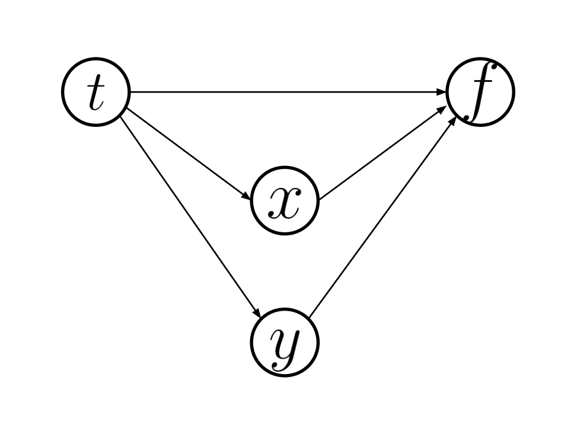
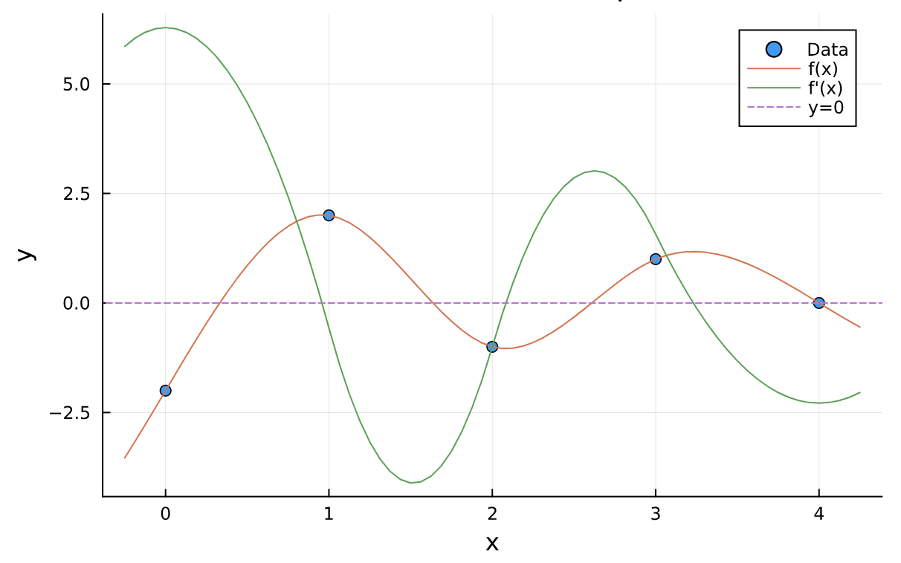
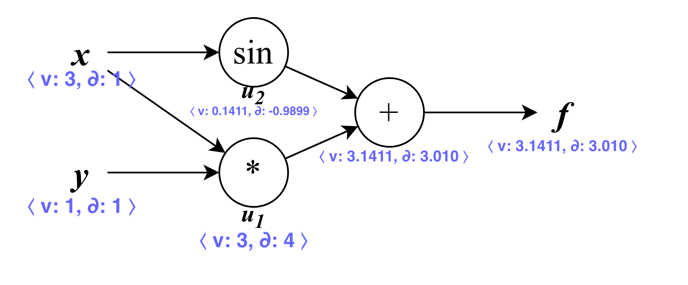

# Summary for 204381: Chapter 3

<aside>
📚 **Organized by**
Saksinkarn Petchkuljinda
630510600

</aside>

<aside>
📄 **********************************Basic Information**********************************
Date: 27 August 2023
Time: 3:30 PM — 6.30 PM
Venue: TBA
**★ Calculator 🧮    ☆ Open Book 🙌🏼**

</aside>

# Table of Contents

---

# Review: Definition of Derivatives

A derivative of a function $y := f(x)$ is defined for every $x\in[a, b]$ that $f(x)$ is a continuous function, such that:

$$

y^\prime = f^\prime(x) = \frac{d}{dx}f(x) = \frac{dy}{dx} = \lim_{\Delta x \to 0} \frac{f(x + \Delta x) - f(x)}{\Delta x}

$$

> The long equation is just to clarify that these terms are usually interchangeable. From now on, only one of them is used at a time.
> 

The above definition is also known as the **forward approach**.

A derivative can also be defined on a **backward approach** form, such that:

$$

f^\prime(x) = \lim_{\Delta x \to 0} \frac{f(x) - f(x - \Delta x)}{\Delta x}

$$

A derivative of $f(x)$ at $x=a$ can also be defined as the difference between $f(a_2)$ and $f(a_1)$, over the difference between $a_2$ and $a_1$, where $a_1 < a < a_2$, such that

$$

f^\prime(a) \approx \frac{f(a_2) - f(a_1)}{a_2 - a_1}

$$

As you may notice, $\Delta x$ might be equivalent to $\Delta x = a_2 - a_1$.

# Review: Derivative Rules

Though the midterm examination might not be that difficult, this section is here in case of really need to use them later.

Given $a$, $c$, $n$ be constants where $a > 0$, $e$ be the Euler’s number ($e \approx 2.718$), $x$ be a variable corresponding to any functions. The followings are the derivative rules for each function.

## Common Functions

$$
\frac{d}{dx} c = 0 
$$

$$
\frac{d}{dx} ax^n = nax^{n-1} 
$$

$$
\frac{d}{dx} e^x = e^x 
$$

$$
\frac{d}{dx} a^x = a^x \ln(a) 
$$

$$
\frac{d}{dx} \ln(x) = \frac{1}{x} 
$$

$$
\frac{d}{dx} \log_a(x) = \frac{1}{x \ln(a)} 
$$

## Trigonometric Functions

$$
\frac{d}{dx} \sin(x) = \cos(x) 
$$

$$
\frac{d}{dx} \cos(x) = -\sin(x) 
$$

$$
\frac{d}{dx} \tan(x) = \sec^2(x) 
$$

$$
\frac{d}{dx} \sin^{-1} (x) = \frac{1}{\sqrt{1-x^2}} 
$$

$$
\frac{d}{dx} \cos^{-1} (x) = -\frac{1}{\sqrt{1-x^2}} 
$$

$$
\frac{d}{dx} \tan^{-1} (x) = \frac{1}{1-x^2} 
$$

## Common Rules

$$
\frac{d}{dx} c\cdot f(x) = c \cdot \frac{d}{dx} f(x) 
$$

$$
(f \pm g)^\prime (x) = f^\prime(x) \pm g^\prime(x)
$$

$$
(fg)\prime(x) = (fg\prime)(x) + (gf\prime)(x)
$$

$$
\Big(\frac{f}{g}\Big)^\prime(x) = \Big(\frac{f^\prime g - g^\prime f}{g^2}\Big)(x) 
$$

$$
\Big(\frac{1}{f}\Big)^\prime(x) = -\Big(\frac{f^\prime}{f^2}\Big)(x) 
$$

## Chain Rule

$$
\frac{dy}{dx} = \frac{dy}{du_1} \cdot \frac{du_1}{du_2}\cdot ... \cdot \frac{du_n}{dx} 
$$

or

$$
(f \circ g)^\prime(x) = (f^\prime \circ g)(x)\cdot g^\prime(x)
$$

## $n^{th}$ Derivatives

$$
\frac{d^n}{dx^n} f(x) = \underbrace{\frac{d}{dx}...\frac{d}{dx}}_{n\ terms} f(x) 
$$

## Partial Derivative

means treating $x$ as a variable, and the rest ($y$ and others whatsoever) as constants. Denoting $d/dx$ refers to the **total derivatives**, which is

$$
\begin{align*}
\frac{\partial}{\partial x}f(x, y) = f^\prime_x(x, y) = \partial_xf(x, y)
\end{align*}
$$

For indirect dependency,

$$
\frac{df}{dt} = \frac{\partial f}{\partial x} \frac{dx}{dt} + \frac{\partial f}{\partial y} \frac{dy}{dt}
$$

For direct dependency

$$
\frac{df}{dt} =   \frac{\partial f}{\partial x} \frac{\partial x}{\partial t} + \frac{\partial f}{\partial y} \frac{\partial y}{\partial t}
$$

Where $f$ be the function of $x, y$ and $x, y$ be dependant variables of $t$.

*Suppose the dependency between variables are as follows*



# Review: Taylor’s Series (Taylor’s Expansion)

<aside>
📄 **Reference**
- [https://en.wikipedia.org/wiki/Taylor_series](https://en.wikipedia.org/wiki/Taylor_series)
- [https://en.wikipedia.org/wiki/Taylor's_theorem#Explicit_formulas_for_the_remainder](https://en.wikipedia.org/wiki/Taylor%27s_theorem#Explicit_formulas_for_the_remainder)

</aside>

Any function of real $f(x)$ can be expressed as ***Taylor's Expression*** around a differentiable point $x=a$, such that

$$
\begin{align*}
f(x) &\approx f(a) + \frac{f^\prime(a)}{1!}(x - a) + \frac{f^{\prime\prime}(a)}{2!}(x - a)^2+ \frac{f^{\prime\prime\prime}(a)}{3!}(x - a)^3 + ... \\
&\approx \lim_{n \to \infty} \sum^{n}_{k=0} \frac{f^{(k)}(a)}{k!}(x - a)^k
\end{align*}
$$

Taylor’s series are very useful to approximate many irrational valued functions, such as $\log(x)$, $\ln(x)$, $\sin(x)$, $\cos(x)$, or even the Euler’s number $e$, using polynomial forms, which are well-studied by mathematicians for centuries.

However, Taylor’s series for $k + 1$ times differentable function $f(x)$ on the open interval with $f^{(k)}$ continuous on $x \in [a, x]$ do have a significant error term $R_n(x)$ such that

$$
R_n(x) = \frac{f^{(n+1)}(\xi_L)}{(n+1)!} (x-a)^{n+1}
$$

For some real number $\xi_L \in (a, x)$. This form of $R_n(x)$ is also called the **Lagrange** Form.

So practically, the Taylor’s series for $f(x)$ around $x = a$ is

$$
f(x) \approx \sum^{n}_{i=0} \frac{f^{(i)}(a)}{i!}(x - a)^i + R_n(x) 
$$

for some positive integer $n$.

# Review: Maclaurin’s Series

<aside>
📄 Reference: [https://mathworld.wolfram.com/MaclaurinSeries.html](https://mathworld.wolfram.com/MaclaurinSeries.html)

</aside>

Maclaurin’s series are the modified version of Taylor’s series for a function $f(x)$ **around the differentable point $x=0$**, or

$$
\begin{align*}
f(x) &\approx f(0) + \frac{f^\prime(0)}{1!}x + \frac{f^{\prime\prime}(0)}{2!}x^2+ \frac{f^{\prime\prime\prime}(0)}{3!}x^3 + ...  \\
&\approx \lim_{n \to \infty} \sum^{n}_{i=0} \frac{f^{(i)}(0)}{i!}x^i 
\end{align*}
$$

There are plenties of Maclaurin series expansions for a complex argument $x$, for example:

$$
\begin{align*}
e^x &= \sum^\infty_{n=0} \frac{x^n}{n!} = 1 + x + \frac{x^2}{2!} + \frac{x^3}{3!} + …&\text{; }-\infty < x < \infty \\
\ln(1+x) &= \sum^\infty_{n=1} (-1)^{n+1} \frac{x^n}{n} =x-\frac{1}{2}x^2+\frac{1}{3}x^3+... &\text{; }-1<x<1 \\
\frac{1}{1-x} &= \sum^\infty_{n=0} x^n = 1+x+x^2+x^3+... &\text{; }-1 < x < 1
\end{align*}
$$

# 3 Types of Computational Differentiations

According to the definition of the derivative of a function, it is impossible to calculate the derivative directly because we cannot calculate the division with the denominator (in this case, $h$) being ************zero************. In order to solve this, there are 3 approaches to calculate derivatives in computers.

## Symbolic Differentiation

In this approaches, just determine the derivative of function $f$ of ***any real $x$***, then substitute the derived expression in computer code. Given we know a simple $f(x)$ function, such as $f(x) = x^3 - 3x + 1$, it is easy to determine $f\prime(x) = 3x^2 - 3$.

### Code Implementation

```julia
function f(x::Number)::Number  # f(x)
		return x^3 - 3x + 1
end

function df(x::Number)::Number  # the derivative of f(x)
		return 3x^2 - 3
end
```

### Advantages

The calculation is usually precise when the expression is not too complicated because the calculation was made directly without approximation.

### Disadvantages

This approach is not suitable when the function is too complex to manually evaluate the exact derivative (by hand), such as

$$
f(x) = \frac{\log(1 + e^{5x^3})}{\sin(3x)+\cos(x/6)}
$$

How to evaluate $f^\prime(x)$? But even though we know $f^\prime(x)$, which is (thanks to [WolframAlpha](https://www.wolframalpha.com/input?i=What+is+the+derivative+of+f%28x%29+%3D+%5Cfrac%7B%5Clog%281+%2B+e%5E%7B5x%5E3%7D%29%7D%7B%5Csin%283x%29%2B%5Ccos%28x%2F6%29%7D%3F))

$$
f^\prime(x) = \frac{15 e^{5 x^3} x^2}{(e^{5 x^3} + 1) (\sin(3 x) + \cos(x/6))} - \frac{\log(e^{5 x^3} + 1) (3 \cos(3 x) - \frac{1}{6} \sin(x/6))}{(\sin(3 x) + \cos(x/6))^2}
$$

It is still computationally expensive and inefficient because the expression is just too complex to handle computationally precisely and accurately.

## Numerical Differentiation

The goal of numerical differentiation is not to provide the exact derivatives, but the approximated ones using purely numbers.

### Forward Approach and Implementation

Formally speaking, we want to approximate $f(x)$ using the ************forward approach************ with some relatively small positive real $h \to 0$, in the way that,

$$

f^\prime(x) = \lim_{h \to 0} \frac{f(x + h) - f(x)}{h} \Rightarrow f^\prime(x) \approx \frac{f(x + h) - f(x)}{h} 

$$

```julia
function forward_diff(f::Function, x::Number, h::Number = 1e-9)::Number
    return (f(x + h) - f(x)) / h
end
```

**********Note: `AeB` means* $A \times 10^B$.

### Backward Approach and Implementation

For the **********************************backward approach**********************************, it is

$$

f^\prime(x) = \lim_{h \to 0} \frac{f(x) - f(x - h)}{h} \Rightarrow f^\prime(x) \approx \frac{f(x) - f(x - h)}{h} 

$$

```julia
function backward_diff(f::Function, x::Number, h::Number = 1e-9)::Number
    return (f(x) - f(x - h)) / h
end
```

However, if the value of $h$ is too small, it would cause significant errors, due to underflows and cancellation errors. But there’s a way to resolve this problem.

### Symmetric Approach: Derivation and Implementation

According to the Taylor’s series of $n$ finite terms for a function $f(x)$ around $x = a$, with an error term:

$$
\begin{align*}
f(x) &= f(a) + \frac{f^\prime(a)}{1!}(x - a) + ... + \frac{f^{(n)}(a)}{n!}(x - a)^n + \frac{f^{(n+1)}(\xi_L)}{(n+1)!} (x-a)^{n+1} \\
&= \sum^{n}_{k=0} \frac{f^{(k)}(a)}{k!}(x - a)^k + \frac{f^{(n+1)}(\xi_L)}{(n+1)!} (x-a)^{n+1}
\end{align*}
$$

Let $a = x$, and $h$ be a relatively small positive real number, and $n = 2$:

$$
\begin{align*}
f(x + h) &= \frac{f(x)}{0!} + \frac{f^\prime(x)}{1!}h + \frac{f^{\prime\prime}(x)}{2!}h^2 + \frac{f^{\prime\prime\prime}(\xi_1)}{3!} h^3&\ \ \ \ \_\_\_\_\text{(1)} \\
f(x - h) &= \frac{f(x)}{0!} - \frac{f^\prime(x)}{1!}h + \frac{f^{\prime\prime}(x)}{2!}h^2 - \frac{f^{\prime\prime\prime}(\xi_2)}{3!} h^3&\ \ \ \ \_\_\_\_\text{(2)} \\
\text{(1) - (2);}\ \ \ \ f(x + h) - f(x-h) &= 2\frac{f^\prime(x)}{1!} - \frac{h^3}{3!}[f^{\prime\prime\prime}(\xi_1) - f^{\prime\prime\prime}(\xi_2)] \\
&\text{[ multiply with } \frac{1}{2h}\text{ on both sides]} \\
\frac{f(x + h) - f(x-h)}{2h} &= f^\prime(x) - \frac{h^{\textcolor{red}{2}}}{2\cdot3!}[f^{\prime\prime\prime}(\xi_1) - f^{\prime\prime\prime}(\xi_2)] \\
f^\prime(x) &= \frac{f(x + h) - f(x-h)}{2h} + \frac{h^2}{12}[f^{\prime\prime\prime}(\xi_1) - f^{\prime\prime\prime}(\xi_2)]&\ \ \ \ \_\_\_\_(\alpha)
\end{align*}
$$

where $x < \xi_1 < x+h$ and $x-h < \xi_2 < x$.

Consider the Taylor’s series on the ********************************forward approach********************************, given $a = x$, and $h$ be a relatively small real number, and $n = 1$:

$$
\begin{align*}
f(x + h) &= \frac{f(x)}{0!} + \frac{f^\prime(x)}{1!}h + \frac{f^{\prime\prime}(\xi_1)}{2!} h^2 \\
f(x + h) - f(x) &= f^\prime(x)\cdot h + \frac{f^{\prime\prime}(\xi_1)}{2!} h^2 \\
\text{[ multiply with } &\frac{1}{h}\text{ on both sides]} \\
\frac{f(x + h) - f(x)}{h} &= f^\prime(x) + \frac{f^{\prime\prime}(\xi_1)}{2!} h \\
f^\prime(x) &= \frac{f(x + h) - f(x)}{h} - \frac{f^{\prime\prime}(\xi_1)}{2!} h &\ \ \ \ \_\_\_\_(\beta) \\
\end{align*}
$$

Consider the Taylor’s series on the ********************************backward approach********************************, given $a = x$, and $h$ be a relatively small real number, and $n = 1$:

$$
\begin{align*}
f(x - h) &= \frac{f(x)}{0!} - \frac{f^\prime(x)}{1!}h + \frac{f^{\prime\prime}(\xi_\gamma)}{2!} h^2 \\
f(x - h) - f(x) &= -f^\prime(x)\cdot h + \frac{f^{\prime\prime}(\xi_2)}{2!} h^2 \\
\text{[ multiply with } &\frac{1}{h}\text{ on both sides]} \\
\frac{f(x - h) - f(x)}{h} &= -f^\prime(x) + \frac{f^{\prime\prime}(\xi_2)}{2!} h \\
-f^\prime(x) &= \frac{f(x - h) - f(x)}{h} - \frac{f^{\prime\prime}(\xi_2)}{2!} h \\
f^\prime(x) &= \frac{f(x) - f(x - h)}{h} + \frac{f^{\prime\prime}(\xi_2)}{2!} h &\ \ \ \ \_\_\_\_(\gamma)
\end{align*} 
$$

$(\beta)$ and $(\gamma)$ have greater significance on the **truncation error (**$\frac{f^{\prime\prime} (\xi_i)}{2!}h^2$**)** terms compared to $(\alpha)$ ($\frac{h^2}{12}[f^{\prime\prime\prime}(\xi_1) - f^{\prime\prime\prime}(\xi_2)]$) because:

- $f^{\prime\prime\prime}(\xi_1) - f^{\prime\prime\prime}(\xi_2)$ causes cancellation error, so the subtraction reduces the significance of the errors found in the differentation.
- The term $h^2/12$ helps further reducing the errors by getting multiplied with $f^{\prime\prime\prime}(\xi_1) - f^{\prime\prime\prime}(\xi_2)$.

Therefore, $(\alpha)$ is better for this task, called **symmetric method**, which is

$$
\frac{d}{dx} f(x) \approx \frac{f(x + h) - f(x - h)}{2h} 
$$

```julia
function sym_diff(f::Function, x::Number, h::Number = 1e-9)::Number
    return (f(x + h) - f(x - h)) / 2h
end
```

### Four-point Method: Derivation and Implementation

*In this subsection, we refer to this paper:*

<aside>
📄 Reference:
[https://www.uio.no/studier/emner/matnat/math/MAT-INF1100/h08/kompendiet/diffint.pdf](https://www.uio.no/studier/emner/matnat/math/MAT-INF1100/h08/kompendiet/diffint.pdf)

</aside>

Even though the symmetric approach does a great job on improving accuracy, we can even further improve this using the four-point method. As the name suggests, we use the **Cubic Newton Polynomial** to interpolate $f(x)$, and that’s why it’s four-point.

Instead of considering one step $h$ as in $x - h$ and $x + h$, we expand it to 2 steps as in $x + 2h$ and $x - 2h$. Given the interpolants are the points where $x_0 = x - 2h$, $x_1 = x - h$, $x_2 = x + h$, $x_3 = x + 2h$, the Newton polynomial $p_3(x)$ for such the points is

$$
\begin{align*}
p_3(x) = \ &f(x_0) + f\big[x_0, x_1\big] (x - x_0) + f\big[x_0, x_1, x_2\big] (x - x_0)(x - x_1) \\
&+ f\big[x_0, x_1, x_2, x_3\big] (x - x_0)(x - x_1)(x - x_2) 
\end{align*}
$$

And the derivative of $f(x)$ is

$$
\begin{align*}
f^\prime(x) = p_3^\prime(x) =\ &f\big[x_0, x_1\big] + f\big[x_0, x_1, x_2\big](2x - x_0 - x_1) \\
&+ f\big[x_0, x_1, x_2, x_3\big]\big( (x - x_1)(x - x_2) + (x - x_0)(x - x_2) + (x - x_0)(x - x_1) \big) 
\end{align*}
$$

Note that the divided difference terms are constants, since $x_0, x_1, x_2, x_3$ are constants. So the derivative of those terms will be zero.

By further simplify this expression (the author of this paper omitted the derivation because it is too complicated), we finally get

$$
f^\prime(x) \approx \frac{f(x - 2h) - 8f(x - h) + 8f(x + h) - f(x + 2h)}{12h}
$$

```julia
function fp_diff(f::Function, x::Number, h::Number = 1e-9)::Number
    return (f(x - 2h) - 8f(x - h) + 8f(x + h) - f(x + 2h)) / 12h
end
```

### Comparison between each approaches

Using $f(x) = e^x \Rightarrow f^\prime(x) = e^x$ at $x = 0$ with different values of $h$.

.png)

The following plot shows that the **four-point method provides the least errors**, while the **************************symmetric method is the first-runner up for having the most accurate result**************************.

### Differentiation using Interpolations

This method works when the definition of $f(x)$ in unclear, or only some points are known.

****************************General Approach:****************************

1. Interpolate the data using any interpolation techniques.
2. Then, evaluate the derivative of the interpolation (maybe using the symbolic diff or numerical diff)

If it’s done correctly, it will be shown as the below example.



### Case study: differentiate a Lagrange polynomial of 2 points.

The polynomial is

$$
P(x) = f(x_0)L_0(x) + f(x_1)L_1(x)
$$

where

$$
L_0(x) = \frac{x-x_1}{x_0-x_1}\\\ \text{ and }\ L_1(x) = \frac{x-x_0}{x_1-x_0}
$$

Consider $L_0^\prime(x)$ and $L_1^\prime(x)$, we get

$$
L_0^\prime(x) = \frac{1}{x_0-x_1}\ \text{ and }\ L_1^\prime(x) = \frac{1}{x_1-x_0}
$$

Then,

$$
\begin{align*}
f^\prime(x) \approx P^\prime(x) &= f(x_0)L^\prime_0(x) + f(x_1)L^\prime_1(x) \\
&= \frac{f(x_0)}{x_0-x_1} + \frac{f(x_1)}{x_1-x_0} \\
&= \frac{f(x_1) - f(x_0)}{x_1-x_0}
\end{align*}
$$

Let $x_0 = x$ and $x_1 = x + h$,

$$
f^\prime(x) \approx \frac{f(x + h) - f(x)}{h}
$$

This is the same as forward approach.

### Choosing the perfect value of $h$

*In this subsection, we refer to this paper:*

<aside>
📄 Reference:
[https://www.uio.no/studier/emner/matnat/math/MAT-INF1100/h08/kompendiet/diffint.pdf](https://www.uio.no/studier/emner/matnat/math/MAT-INF1100/h08/kompendiet/diffint.pdf)

</aside>

Theoretically, the value of $h$ should be as small as possible, but it is not practically true when there’s a limitation on floating-point numbers (e.g. IEEE-754).

The following table from the paper shows that smaller $h$ computationally increases the error. Let $f(x) = \sin(x)$. We evaluate $f^\prime(0.5) \approx 0.8775825619$ using different values of $h$.

| $h$ | $[f(a + h) - f(a)] / h$ | error; given $a$, $h$ |
| --- | --- | --- |
| $10^{-7}$ | $0.8775825372$ | $2.5\times10^{-8}$ |
| $10^{-8}$ | $0.8775825622$ | $-2.9\times10^{-10}$ |
| $10^{-9}$ | $0.8775825622$ | $-2.9\times10^{-10}$ |
| $10^{-11}$ | $0.8775813409$ | $1.2\times10^{-6}$ |
| $10^{-14}$ | $0.8770761895$ | $5.1\times10^{-4}$ |
| $10^{-15}$ | $0.8881784197$ | $-1.1\times10^{-2}$ |
| $10^{-16}$ | $1.110223025$ | $-2.3\times10^{-1}$ |
| $10^{-17}$ | $0.000000000$ | $8.8\times10^{-1}$ |

As you can see, from $h$ smaller than $10^{-11}$, the error was getting bigger, and the value became underflow (the value went completely zero) when $h = 10^{-17}$. Let $\epsilon^*$ be the **********maximum relative error********** of $f$ at $x = a$.

From [Chapter 5](https://www.uio.no/studier/emner/matnat/math/MAT-INF1100/h08/kompendiet/round-off.pdf) of the same book this subsection refers to, we can determine $\epsilon^*$ with the followinng:

<aside>
📄 Reference: [https://www.uio.no/studier/emner/matnat/math/MAT-INF1100/h08/kompendiet/round-off.pdf](https://www.uio.no/studier/emner/matnat/math/MAT-INF1100/h08/kompendiet/round-off.pdf)

</aside>

$$
\epsilon^* = 5\times\beta^{-m}
$$

where $\beta$ be the numerical base system used in the calculation, and $m$ be the maximum digits of mantissa possible (**************e.g. `Float64` has* $m = 52$). Since we use `Float64`, we will let $m = 52$ and then

$$
\epsilon^* = 5\times2^{-52} \approx 1.11\times10^{-15}
$$

 $h^*$ be the best value of $h$ **********************************************for forward and backward approach**********************************************,

$$
h^* \approx 2\frac{\sqrt{\epsilon^*|f(a)|}}{\sqrt{|f^{\prime\prime}(a)|}} 
$$

For example, $e^* = 7\times10^{-17} \rightarrow h^* = 2\sqrt{7\times10^{-17}} \approx 1.7\times10^{-8}$.

**For four-point method**, it is

$$
h^* \approx 2\frac{\sqrt[5]{27\epsilon^*|f(a)|}}{\sqrt[5]{|f^{(5)}(a)|}} 
$$

**For symmetric method**, we use the different $h^*$, which is

$$
h^* \approx 2\frac{\sqrt[3]{3\epsilon^*|f(a)|}}{\sqrt[3]{|f^{\prime\prime\prime}(a)|}} 
$$

For example, $e^* = 7\times10^{-17} \rightarrow h^* = 4.6\times10^{-6}$.

For example, $h^* = 8.8\times10^{-4}$. Notice that the value of $h^*$ gets smaller when the methods gets more complicated.

### Second Derivatives

One way to find the second derivative of $f(x)$ is to do the derivation twice

$$
\frac{d^2}{dx^2} f(x) = \frac{d}{dx} \frac{d}{dx} f(x)
$$

But for the numerically more stable way, using the same symbolic technique by deriving from the Taylor’s expansions.

From the previous subsection,

$$
\begin{align*}
\text{(1) + (2);}\ \ \ \ f(x + h) + f(x-h) &= 2f(x) + f^{\prime\prime}(x)h^2 + \frac{h^3}{3!}[f^{\prime\prime\prime}(\xi_1) - f^{\prime\prime\prime}(\xi_2)] \\
f^{\prime\prime}(x)h^2 &= f(x + h) - 2f(x) + f(x-h) - \frac{h^3}{3!}[f^{\prime\prime\prime}(\xi_1) - f^{\prime\prime\prime}(\xi_2)] \\
f^{\prime\prime}(x) &= \frac{f(x + h) - 2f(x) + f(x-h)}{h^2} - \frac{h}{6}[f^{\prime\prime\prime}(\xi_1) - f^{\prime\prime\prime}(\xi_2)]
\end{align*}
$$

Therefore, the symmetric approach for the second derivative of $f^{\prime\prime}(x)$ is

$$
f^{\prime\prime}(x) \approx \frac{f(x + h) - 2f(x) + f(x-h)}{h^2}
$$

```julia
function second_diff(f::Function, x::Number, h::Number = 1e-9)::Number
    return (f(x + h) - 2 * f(x) + f(x - h)) / h^2
end
```

### Advantages

- Works with any functions because we only consider their numerical values.
- Fast to calculate.
- Easy to implement even if the derivations are so complicated (like above).

### Disadvantages

The result are highly influenced by rounding errors, since everything is done under floating point number arithmetics.

## Automatic Differentiation (AD)

<aside>
📄 Reference:
[https://www.cs.ubc.ca/~fwood/CS340/lectures/AD1.pdf](https://www.cs.ubc.ca/~fwood/CS340/lectures/AD1.pdf)

</aside>

### Background

Automatic Differentation is the central balance between both ****************symbolic**************** and ********************numerical******************** approaches. As I stated earlier on the Symbolic Diff section, if you have a complicated function such as:

$$
f(x) = \frac{\log(1 + e^{5x^3})}{\sin(3x)+\cos(x/6)}
$$

How to evaluate $f^\prime(x)$? But even though we know $f^\prime(x)$, which is (thanks to [WolframAlpha](https://www.wolframalpha.com/input?i=What+is+the+derivative+of+f%28x%29+%3D+%5Cfrac%7B%5Clog%281+%2B+e%5E%7B5x%5E3%7D%29%7D%7B%5Csin%283x%29%2B%5Ccos%28x%2F6%29%7D%3F))

$$
f^\prime(x) = \frac{15 e^{5 x^3} x^2}{(e^{5 x^3} + 1) (\sin(3 x) + \cos(x/6))} - \frac{\log(e^{5 x^3} + 1) (3 \cos(3 x) - \frac{1}{6} \sin(x/6))}{(\sin(3 x) + \cos(x/6))^2}
$$

In the short-term, determining the exact derivative expression is just OK. However,

- What if you want to modify the formula a little bit, will the derivative drastically change?
- What if the given function $f(x)$ is (programmatically) unknown and unpredictable (for instance, you might encounter a situation that $f(x)$ is retrieved only from a function parameter), *would you just use the numerical diff and become ready to face with numerical errors?*
- Even if you know the exact derivative of $f(x)$ for a given set of $x$ (like $f^\prime(x)$ above), it looks very complex. That might also causes a number of numerical errors (rounding errors, overflow/underflow, cancellation errors)

As I discussed in the Numerical Diff section, numerical differentation are easily prone to error. So that would not be the alternative solution either.

********************************************************************The idea of Automatic Differentiation******************************************************************** is: instead of trying to figure out the derivative of the whole function, why don’t we just… calculate them separately? Even though, $f(x)$ is too complex, considering a single term alone, like $\sin(3x)$, you can easily recognize that the derivative of $\sin(3x)$ will be $3\cos(3x)$. Furthermore, the form of $f(x)$ looks relatively simpler than $f^\prime(x)$, leading to less errors. This idea is possible because of the ******************chain’s rule.****************** Therefore, Automatic Differentiation simply combines the advantages of symbolic differentiation for providing a precise derivative of complicated functions.

There are 2 modes of automatic differentiations, as follows:

### Forward Mode

This method ********************************************************calculates and differentiate******************************************************** the value of $f(x)$ **concurrently** throughout the process.

<aside>
ℹ️ For the sake of simplicity, I will only demonstrate for a function of $\mathbb{R}^m\rightarrow\mathbb{R}$ and $\mathbb{R}\rightarrow\mathbb{R}^n$.
Please understand. 😢

</aside>

Let’s say we want to evaluate the derivative of $f(x, y) = xy + \sin(x)$ *(which is  $f: \mathbb{R}^2 \rightarrow \mathbb{R}$)* at $(x, y) = (3, 1)$. We will demonstrate them step by step to see how it works.

| Step | Unit | Expression | Value | Derivative |
| --- | --- | --- | --- | --- |
| 1 | $x$ | $x$ | $3$ | $dx = 1$ |
| 2 | $y$ | $y$ | $1$ | $dy = 1$ |
| 3 | $u_1$ | $xy$ | $3\cdot1=3$ | $du_1 = x\ dy + y\ dx$
$= 3 + 1 = 4$ |
| 4 | $u_2$ | $\sin(x)$ | $0.1411$ | $du_2 = d(\sin(x)) = \cos(x)\ dx$
$= \cos(3)\cdot 1 = -0.9899$ |
| 5 | $f$ | $u_1 + u_2$ | $3.1411$ | $df = d(u_1 + u_2) = du_1+du_2$
$= 4+(-0.9899) = 3.01001$ |

************This is the **************************************computational graph************************************** for* $f(x, y)$*.*



Note: Initially, the derivative of any ****************variables**************** are $1$, while the derivative of any ******************constants****************** are 0. This is why we set both $dx = dy = 1$ at the beginning.

************************Observation: Forward Mode AD represents a linear problem.************************ For example, we can determine the derivative of the function above from $Y$ such that

$$
\begin{align*}
J_f X &= Y \\
Y &= \begin{bmatrix}
\frac{\partial f}{\partial x} & \frac{\partial f}{\partial y}
\end{bmatrix}
\begin{bmatrix}
\partial x \\ \partial y
\end{bmatrix} \\
&= \begin{bmatrix}
\overbrace{(y + \cos(x)) \underbrace{\partial x}_{= 1}}^{\text{from }\frac{\partial f}{\partial x}} + \underbrace{x\ \overbrace{\partial y}^{=1}}_{\text{from }\frac{\partial f}{\partial y}}
\end{bmatrix}
\end{align*}
$$

Here $(y + \cos(x)) \partial x + x\ \partial y$ is the symbolic derivative of $f(x, y)$ we were looking for.  And the vector $\begin{bmatrix}1 & 1\end{bmatrix}^T$ is the vector of $\partial x$ and $\partial y$ respectively.

To implement in Julia, first define type `Context` that stores both the current value and its derivative.

<aside>
📄 The code implementation was modified from the following references:
- [https://vladium.com/tutorials/study_julia_with_me/multiple_dispatch/](https://vladium.com/tutorials/study_julia_with_me/multiple_dispatch/)
- [https://github.com/JuliaLang/julia/blob/147bdf428cd14c979202678127d1618e425912d6
/base/complex.jl#L49](https://github.com/JuliaLang/julia/blob/147bdf428cd14c979202678127d1618e425912d6/base/complex.jl#L49)

</aside>

```julia
struct Context{T<:Number} <: Number  # let Context acts as a normal Number
    v::T  # value
		∂::T  # derivative
end
```

Also define how to convent a regular Julia `Number` into `Context`.

```julia
Context(x::T) where {T<:Number} = Context(x, 0.0)
Context(x::T, y::S) where {T<:Number, S<:Number} = Context(promote(x, y)...)

Context{T}(x::Real) where {T<:Real} = Context{T}(x, 0)
Context{T}(z::Context) where {T<:Real} = Context{T}(v(z), ∂(z))

Context(z::Context) = z

Base.promote_rule(::Type{Context{T}}, ::Type{S}) where {T<:Number, S<:Number} =
    Context{promote_type(T, S)}
Base.promote_rule(::Type{Context{T}}, ::Type{Context{S}}) where {T<:Real, S<:Real} =
    Context{promote_type(T, S)}
```

Then define operators over `Context`

```julia
# binary operators
Base.:(+)(lhs::Context, rhs::Context) = Context(lhs.v + rhs.v, lhs.∂ + rhs.∂)
Base.:(-)(lhs::Context, rhs::Context) = Context(lhs.v - rhs.v, lhs.∂ - rhs.∂)
Base.:(*)(lhs::Context, rhs::Context) = Context(
    lhs.v * rhs.v, lhs.v * rhs.∂ + lhs.∂ * rhs.v
)
Base.:(/)(lhs::Context, rhs::Context) = Context(
    lhs.v / rhs.v, (lhs.∂ * rhs.v - lhs.v * rhs.∂) / rhs.v^2
)

# unary operators
Base.:(+)(x::Context) = x
Base.:(-)(x::Context) = Context(-x.v, -x.∂)

# Basic trigonometric functions
Base.:sin(x::Context) = Context(sin(x.v), cos(x.v) * x.∂)
Base.:cos(x::Context) = Context(cos(x.v), -sin(x.v) * x.∂)
Base.:tan(x::Context) = Context(tan(x.v), sec(x.v)^2 * x.∂)

# Exponential functions
Base.:exp(x::Context) = Context(exp(x.v), exp(x.v) * x.∂)
Base.:(^)(base::Context, expo::Context) = Context(
    base.v^expo.v,
    base.v^(expo.v - 1) * expo.v * base.∂ + base.v^expo.v * log(base.v) * expo.∂
)

# Logarithm
Base.log(x::Context) = Context(log(x.v), 1 / x.v * x.∂)
Base.log2(x::Context) = Context(log2(x.v), 1 / ln(2) / x.v * x.∂)
Base.log10(x::Context) = Context(log10(x.v), 1 / ln(10) / x.v * x.∂)
Base.log(b::Context, x::Context) = Context(
    log(b.v, x.v), -log(x.v) / b.v / log(b.v)^2 * b.∂ + 1 / x.v / log(b.v) * x.∂
)

# And more, if necessary...
```

It is also interesting if we compare it to the numerical approach: using our best one **Four-point method** with the proper ****$h$ (using $h = h^* \approx 8.8\times10^{-4}$ from above).

```julia
function fp_diff(f::Function, x::Number, h::Number = 8.8e-4)::Number
    return (f(x - 2h) - 8f(x - h) + 8f(x + h) - f(x + 2h)) / 12h
end
```

The usage is simple, just define what ever function you want. When you want to know the derivative, refer to the attribute`∂`

```julia
function f1(x::Number, y::Number)::Number
    return sin(x * y)
end

x = Context(2, 1)
y = 3  # given the diff is 0 (y is constant)

computed = f1(x, y)
numerical = fp_diff(u -> f1(u, y), x.v)
symbolic = (y * cos(x * y)).v

println("f($(x.v), $y) = $(computed.v)")
println("f'($(x.v), $y) = $(computed.∂)")
println("symbolic = $symbolic")
println("numerical = $numerical")
```

**Output**

```
f(2, 3) = -0.27941549819892586
f'(2, 3)  = 2.880510859951098
symbolic  = 2.880510859951098
numerical = 2.880510859945746
```

In the example above, we demonstrate all kinds of computational differentiation: symbolic, numerical and automatic differentiation. It is obvious that automatic differentiation provides better accuracy and precision than the numerical diff in overall. However, it is worth noting that numerical diff is not that bad for doing diff (if you have a good optimization, like I use the four-point method here), so it is useful in some situations when you want to avoid complicated implementation.

### Reverse Mode (Back Propagation)

This one is a bit different. Instead of calculating values alongside derivatives, it does the opposite by waiting for the values to be completely calculated, and then reverse back to the origin to calculate the derivatives. This one is more difficult to implement, but can be useful in some scenarios when Forward Mode may be slower; we will talk about this later.

***(To be continued…)***

### Advantages

- It does not rely on approximation like numerical method. Therefore, the precision is fascinating.
- It can be applied with a variety of formulas, particularly the complicated ones that cannot be determine symbolically.
- Since the automatic differentiation is also a graph problem (because we can represent the problem as a directed graph, a.k.a. computational graph), it allows even broader study over the optimization on the algorithm.

### Disadvantages

- Difficult to implement ************efficiently** (well-known libraries such as **********NumPy********** or **************PyTorch************** are recommended).*
- Memory-inefficient when the formula is complicated. A good optimization is required.